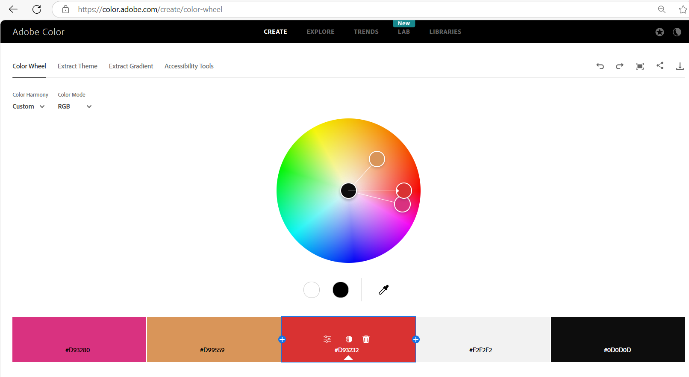
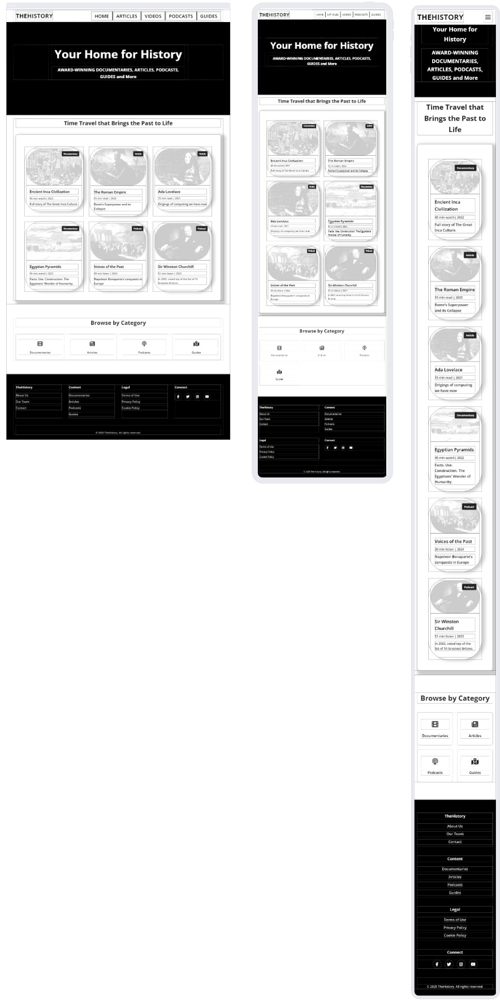
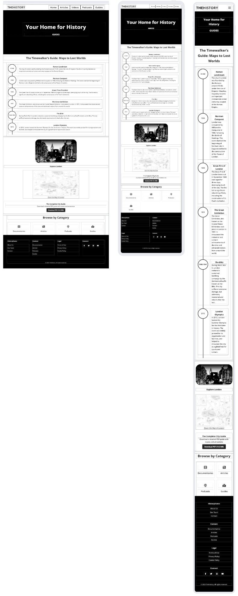
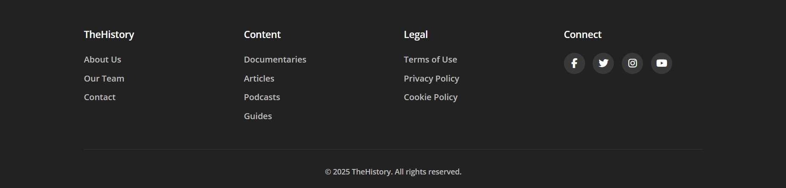
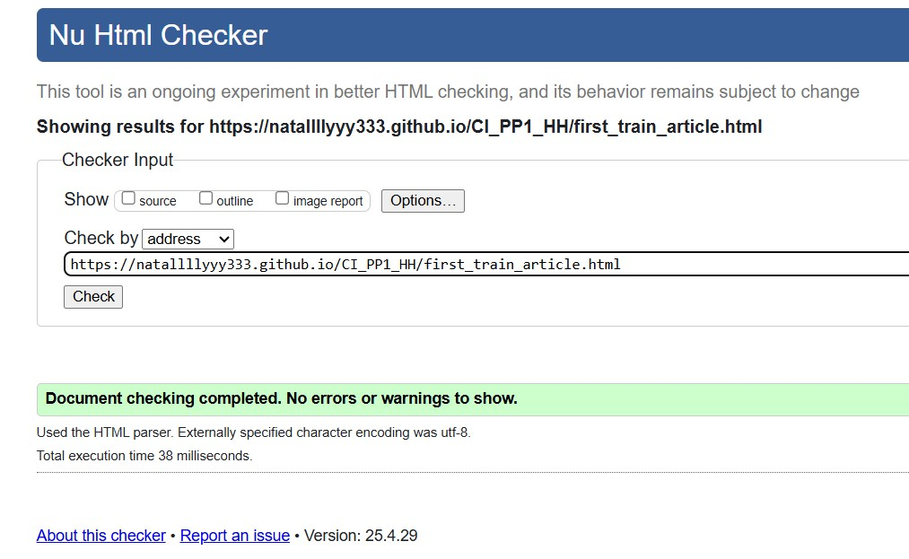
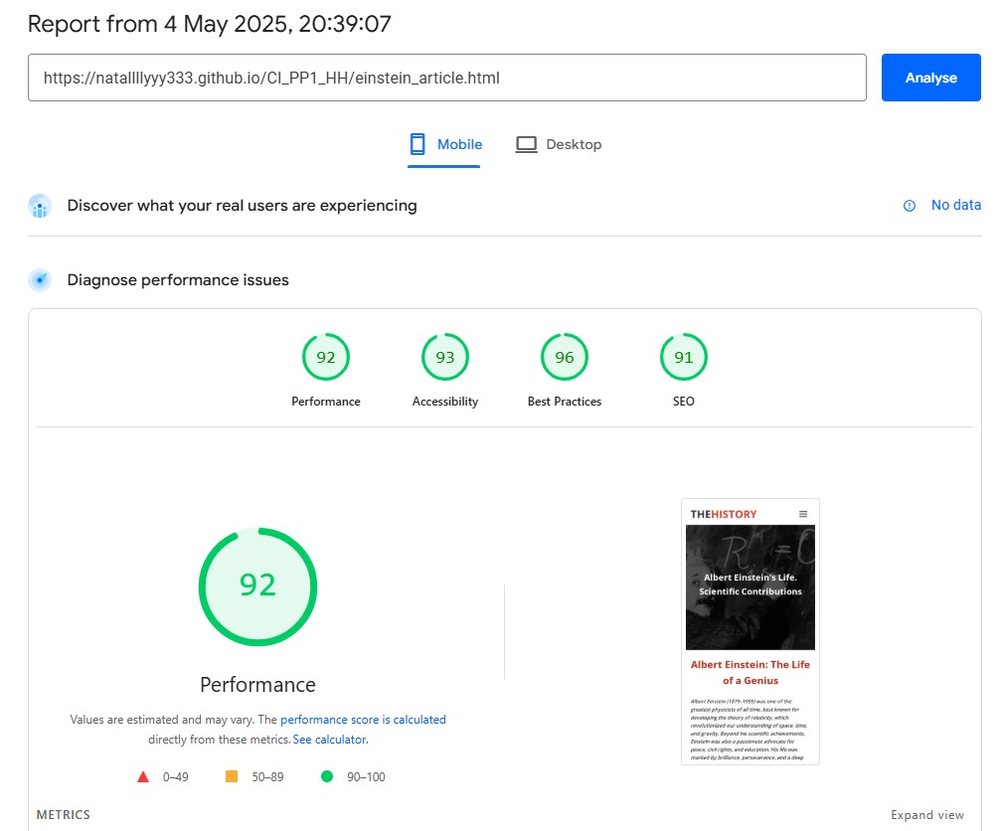

# TheHistory
(Developer: Nataliia Illiashenko)

[Live webpage](https://natallllyyy333.github.io/rehearsal_pp1_hh/)

## Table of Content

1. [Project Goals](#project-goals)
    1. [User Goals](#user-goals)
    2. [Site Owner Goals](#site-owner-goals)
2. [User Experience](#user-experience)
    1. [Target Audience](#target-audience)
    2. [User Requrements and Expectations](#user-requrements-and-expectations)
    3. [User Stories](#user-stories)
3. [Design](#design)
    1. [Design Choices](#design-choices)
    2. [Colour](#colours)
    3. [Fonts](#fonts)
    4. [Structure](#structure)
    5. [Wireframes](#wireframes)
4. [Technologies Used](#technologies-used)
    1. [Languages](#languages)
    2. [Frameworks & Tools](#frameworks-&-tools)
5. [Features](#features)
6. [Testing](#validation)
    1. [HTML Validation](#HTML-validation)
    2. [CSS Validation](#CSS-validation)
    3. [Accessibility](#accessibility)
    4. [Performance](#performance)
    5. [Device testing](#performing-tests-on-various-devices)
    6. [Browser compatibility](#browser-compatability)
    7. [Testing user stories](#testing-user-stories)
8. [Bugs](#Bugs)
9. [Deployment](#deployment)
10. [Credits](#credits)
11. [Acknowledgements](#acknowledgements)

## Project Goals 

### User Goals
- Finding a reliable platform for planning history-themed events or learning more about world history.  
- Accessing clear, organized information on the most important historical events, periods, and the most significant figures in history;  
- Reading articles on the most fascinating historical topics.
- Watching documentaries about the history of individual states and their role in the overall historical process.
- Listening to podcasts about the lives of the most important historical figures. - Exploring guides to key historical sites.
- Easily navigating the site to find specific resources or sections.  
- Contacting the site owner or community for support or collaboration.

### Site Owner Goals
- Showcase educational content on the World History.  
- Attract and engage a target audience interested in History.  
- Provide an intuitive way for users to interact (social links).  
- Deliver essential information in an accessible, visually appealing format.  

## User Experience

### Target Audience
- Students seeking learning resources.  
- Professionals looking for templates/tools.  
- Collaborators interested in joint projects.  

### User Requrements and Expectations

- A simple and intuitive navigation system.
- Fast access to core content. 
- Links and functions that work as expected.
- Good presentation and a visually appealing design regardless of screen size.
- An easy way to contact the website administration.
- Simple content that the user can skim read.
- Accessibility (contrast, keyboard navigation).  
- Clear calls-to-action ("Download," "Contact").  

### User Stories

#### First-time User 
1. As a first-time visitor, I want to understand the site’s purpose immediately.  
2. As a first-time visitor, I want to explore key sections without confusion.  
3. As a first-time visitor, I want to find contact or support options. 

#### Returning User
4. As a returning visitor, I want to check for updates/new content.  
5. As a returning visitor, I want to share feedback or suggestions.  
6. As a returning visitor, I want to bookmark useful resources. 

#### Site Owner 
7. As the owner, I want users to engage with new content: articles, documentaries, podcasts, guides.  
8. As the owner, I want to highlight most significant historical topics.  

## Design

### Design Choices
The site embraces a vibrant aesthetic to reflect the history theme. Key elements include:  
- consistent card layouts for content blocks.  
- custom icons for visual guidance.

### Colour
Cool blues and grays for a calm, professional feel.
Reds and Blacks for highlight and contrast.  
- Tested for accessibility using [WebAIM].  
- Primary Color: #1a1a1a (Dark gray, used for headings and key text)

- Secondary Color: #4a4a4a (Medium gray, used for secondary text/borders)

- Accent Color: #f5f5f5 (Light gray/white, used for backgrounds)
 

Color Contrast (WCAG Compliance)
Tested with WebAIM Contrast Checker:

- Element	Foreground	Background	Ratio	WCAG Rating
- Main text (#1a1a1a)	#1a1a1a	#ffffff	15.9:1	AAA
- Secondary text (#4a4a4a)	#4a4a4a	#ffffff	7.3:1	AAA
- Button text (#ffffff)	#ffffff	#1a1a1a	15.9:1	AAA
- All text passes AA/AAA standards.

### Fonts
- Primary Font: Montserrat - Used for body text, chosen for its clean lines and excellent legibility across devices
- Heading Font: Roboto - Applied to all headings (H1-H6), providing strong visual hierarchy
- Special Elements: Pinyon Script with cursive fallback - Reserved for decorative elements to add elegant flourishes
 Both Montserrat and Roboto are recognized as dyslexia-friendly typefaces, ensuring accessibility for all users.

### Structure
The website is structured in a well known, recognizable, user friendly, and easy to learn way. Upon arriving to the website the user sees a familiar type of navigation bar with the website logo on the left side and the navigation links to the right. A 'Browse by Category' section below the main section of a page and a footer with links to pages: About Us, Our Team, Contact, Documentaries, Articles, Podcasts, Guids, Terms of Use, Privacy Policy, Cokie Policy and the social links.
The website consists of 17 separate pages: 
1. A homepage with a main navigation manu, a section with Featured content cards with short description, themed imagies and links to the according content on Articles page, Documentaries page and Podcasts page.
2. An Articles page with a section with cards with short description, themed imagies and links to an according article page.
3. Separate article pages include: Ada Lovelace article page, Albert Enstein article page, First Train  article page, 11 main Events article page, 17 most singnificant historical figures article page, Roman Empire article page.
4. Documentaries page include varousel sections with videos on History of Egupt, Europe and World.
5. Podcasts page include podcasts on Life and Echievements of historical figures with their pictures and short description.
6. About Us page includes our Mission, our Offers, Our Vision sections.
7. Our Team page includes Our Story, and a schort selfpresentation of the team.
8. Contact page include the contats of the website owner and administration.
9. Terms of Use provide Use of Content, User Responsibilities, Disclamer and Change of Termination sections.
10. Privacy Policy page explains how the website administration handle the user's information when they visit the site.
11. Cookie Policy page provide the policy of the use of cookies on the website.

### Wireframes

Index

Articles

Documentaries

Podcasts

Guides

About Us

Article Page

## Technologies Used

### Languages
- HTML
- CSS

### Frameworks & Tools
- Bootstrap v5.0
- Git
- GitHub
- Gitpod
- Tinypng
- Paint.NET
- Balsamiq
- Google Fonts
- Adobe Color
- Font Awsome
- Favicon.io

## Features
The page consists of seventeen pages and fourteen features

### Logo and Navigation Bar
- Featured on all seventeen pages
- The navbar is fully responsive and changes to a toggler (hamburger menu) on smaller screens and includes
links to the Homepage, Articles page, Documentaries page, Podcasts page, Guides page, Roman Empire Article page, Ada Lovelace Article page, First Train Article page, Einstein Article page, Historical Events Article page, Historical Figures Article page, About Us page, Our Team page, Contact us page, Privacy Policy page, Cookie Police page, Terms of Use page.
- It allows users to easily navigate the page
- The link for the page the user is currently on is highlighted 
- User stories covered: 1

### Hero Section
- Introduces the user to the website with a themed banner
- Eye-Catching Imagery – High-quality visuals to grab attention.
- Headline & Subheadline – Title of the page, motto and content overview
- User stories covered: 2 

### Content Showcase Module
- Allowes the user to see diverse content formats in a scannable way
- Allowes the user to see duration, media type and topics.
- User stories covered: 3

### Feature Browse by Category Module
- Consists of four streamlined categories: Documentaries, Articles, Podcasts, Guides — allowing users to quickly filter content by their preferred format
- Clean, minimal design: Bold heading (# Browse by Category) with direct text links for effortless navigation
- Simplifies content discovery
- Reduces user effort by eliminating nested menus
- Encourages exploration of diverse media types
- User stories covered: 4

### Footer
- Featured on all seventeen pages
- Consists of five distinct sections: Brand identity, quick navigation links, legal policies, and copyright notice
- Organized into columns for clear visual hierarchy and easy user access
- Includes essential elements:
1. About Us: Direct links to About Us, Our Team and Contact pages.
2. Content Hub: Quick access to Documentaries, Articles, Podcasts, and Guides
3. Legal Compliance: Links to Terms of Use, Privacy Policy, and Cookie Policy
4. Social Media Links: Encourages cross-platform interaction
5. Copyright & Branding: Displays "© 2025 HistoryHome. All rights reserved." for legal protection and brand consistency
- User stories covered: 5

### Article Cards Feature
- Displays engaging article previews in a clean, card-based layout, allowing users to quickly scan and select content of interest
- Each card includes:
1. Title: Bold, descriptive headings (e.g., "The Rise and Fall of the Roman Empire").
2. Read Time: Clear duration indicator (e.g., 15 min read) for user convenience.
3. Teaser Text: A concise, compelling summary of the article’s focus.
4. Visual Separators: Clean dividers (---) between cards for improved readability
- Encourages content exploration with scannable, digestible previews.
- Helps users prioritize reading based on interest and time availability.
- Maintains a consistent and organized layout for all article listings.
- User stories covered: 6

### Video Section Navigation Bar Feature
- Provides intuitive category filtering with clear, concise tabs: EGYPT, EUROPE, WORLD.
- Minimalist design: Bold, all-caps text labels for quick scanning and seamless navigation.
- Enables users to instantly switch between regional/thematic video collections.
- Optimizes content discoverability without overwhelming UI.
- Maintains consistency with the site's clean aesthetic.
- User stories covered: 7

### Video Cards Carousel Feature
- Displays a scrollable carousel of 6 video cards, allowing users to browse and select content effortlessly.
- Each video card includes:
1. Category Label (e.g., EGYPT) for quick topic identification
2. Title (e.g., "The Egyptian and Hittite Peace Treaty") with engaging formatting.
3. Duration (e.g., *2:48*) to help users manage their time.
4. Horizontal scrolling for intuitive navigation on screens of above 768px width, vertical on up to 767px width.
5. Enhances content discoverability with a compact, interactive layout.
6. Encourages binge-watching behavior by surfacing related videos.
7. Optimizes space while maintaining readability and visual appeal.
- User stories covered: 8

### Podcasts Feature
- Showcases curated history podcasts with immersive preview cards that blend content, context, and inspiration.
- Each podcast card includes:
1. Engaging title (e.g., "Napoleon: From Empire to Exile")
2. Notable quote from the episode or subject (e.g., Churchill’s "Success is not final...")
3. Host/creator (e.g., SAN FRED)
4. Duration & release year (e.g., *51 minutes | 2025*)
5. Interactive buttons for user actions (play, pause, volume control, playback speed).
- User stories covered: 9

### Podcast Accordion Feature
- Interactive expandable/collapsible section that reveals in-depth podcast content, including transcripts, historical context, and key quotes.
- Structured layout with:
1. Hero quote (e.g., "Success is not final, failure is not fatal...") to set the tone.
2. Podcast metadata (title, duration, release year).
3. Audio progress bar (*0:00 / 51:11*) for real-time tracking.
4. Toggle button (more... ▼ / less... ▲) to expand/collapse full content.
5. Rich transcript with historical insights, timestamps, and supplemental quotes (e.g., Churchill’s 1941 speech).
- Deepens engagement by offering both audio and text-based consumption.
- Enhances accessibility for users who prefer reading or need transcripts.
- Provides educational value through curated historical context.
- User stories covered: 10

### History Timeline Feature
- Presents key historical events in a visually engaging chronological timeline, allowing users to journey through significant moments in London’s history.
- Each timeline entry includes:
1. Event title (e.g., Roman Londinium, The Blitz) with clear heading hierarchy
2. Concise historical summary (2-3 sentences) highlighting the event’s significance.
3. Key dates (e.g., *43 AD, 1066, 1666*) for quick reference.
- Allows user to break down complex history into digestible, scannable segments.
- Provides visual chronology: Helps users grasp the sequence and impact of events.
- Encourages user's exploration with a mix of political, cultural, and catastrophic milestones.
- User stories covered: 11

### Video Guide Feature
- Displays a prominent 45-minute video guide (e.g., "Explore London") as an immersive visual introduction to the location.
- Minimalist, high-impact design with:
1. Duration label (*45:00*) to set expectations.
2. Clear call-to-action title (Explore London) in bold typography.
3. Thumbnail image/play button overlay.
- Virtual tourism: Offers users a cinematic overview of key landmarks/history.
- Time transparency: Duration label helps users commit to viewing.
- Gateway feature: Encourages further exploration of related content (articles, maps).
- User stories covered: 12

### Interactive Zoomable London Map Guide
- Interactive, zoomable map of London with labeled districts (e.g., Wembley, Kensington, Chelsea) for intuitive navigation.
- Clean, minimalist design with:
1. District names displayed in a clear, bold typography.
2. Call-to-action prompt ("Zoom the Map of London") encouraging user interaction.
- Dynamic functionality:
1. Smooth zoom/pan controls (touch or mouse).
2. Responsive to all device screens.
- Helps users visualize London’s layout and key areas.
- Interactive elements invite users's exploration.
- Acts as a visual guide for tourists, historians, or locals.
- User stories covered: 13

### Downloadable City Guide Feature
- Prominently displayed call-to-action for users to download a comprehensive PDF city guide (e.g., "The Complete City Guide").
- Clear, user-friendly design with:
1. Title & description ("Download a detailed PDF guide with routes and attractions") explaining the guide’s value.
2. Download button with file size transparency ("Download PDF (14.3 MB)").
- Offline accessibility: Lets users explore without internet.
- Trust-building: File size disclosure manages user expectations.
- User stories covered: 14

### Article Feature
- Presents in-depth, engaging long-form articles with structured sections, designed to inform and captivate readers.
- Key elements include:
1. Strong headline ("5 Fascinating Facts About Ada Lovelace...") to immediately hook interest.
2. Subheadings (e.g., "Daughter of a Famous Poet") for easy scanning.
3. Pull quotes ("Poetical science") to highlight key insights.
4. Visual dividers (---) for clean section breaks.
5. Concise, lively prose blending history, anecdotes, and analysis.
- Education: Delivers authoritative yet accessible historical/scientific narratives.
- Engagement: Uses storytelling techniques (e.g., humor, tragedy) to humanize subjects.
- Shareability: Optimized for social sharing with standout quotes/facts.
- User stories covered: 15

### About Us
- Introduces the brand’s mission, offerings, and values in a structured, engaging format designed to connect with audiences.
- Key sections include:
1. Mission Statement – A compelling overview of the brand’s purpose ("The past is not just a series of dates and events...").
2. What We Offer – Detailed breakdown of content formats (documentaries, podcasts, articles, travel guides) with persuasive descriptions.
3. Why Choose Us – Bullet-pointed USPs (e.g., "Trusted Experts," "Cinematic Quality") with visual checkmarks for emphasis.
4. Vision Statement – Forward-looking narrative about redefining history education.
- Brand Identity: Communicates ethos, quality standards, and uniqueness.
- User Conversion: Encourages exploration of content by highlighting variety and expertise.
- Trust-Building: Showcases authority (historians, filmmakers) and global perspective.
- User stories covered: 16, 17

### Our Team Feature
- Showcases the people and passion behind the brand, blending origin stories, team roles, and mission-driven philosophy.
- Structured into clear sections:
1. Origin Story – Founder-led narrative ("Founded in 2025 by Nataliia Illiashenko...") with growth milestones.
2. Team Breakdown – Role-based highlights (Researchers, Storytellers, Innovators) emphasizing expertise and collaboration.
3. Mission Statement – Conviction-driven call-to-action ("We believe history shouldn’t be confined...") with relatable examples (myth-busting, travel guides).
4. Inspirational Quote – Closing literary flourish ("The past is never dead...") to reinforce purpose. 
- Humanizes the brand: Puts faces and stories behind the content.
- Builds credibility: Highlights awards, qualifications, and niche roles (e.g., Emmy-nominated filmmakers).
- Engages talent/partners: Signals professionalism and creative ambition.
- User stories covered: 18, 19

### Contact Us Feature
- Invites user engagement through multiple structured contact points, emphasizing approachability and collaboration.
- Organized into clear sections:
1. Intro Statement – Brand philosophy ("history is a conversation—not a monologue") to set a welcoming tone.
2. Purpose-Specific Email Links – Categorized inquiries (General, Podcasts, Partnerships, Submissions) with expected response times.
- Physical Address – For formal visits (with remote-work disclaimer).
- Encourages interaction: Makes reaching out easy for users, experts, and partners.
- Streamlines communication: Directs queries to the right team (e.g., podcasts@historyhome.com for show ideas).
- Professional transparency: Discloses response times and remote-work policy.
- User stories covered: 20, 21

### Terms of Use Feature
- Outlines clear, digestible rules for using the TheHistory platform, balancing legal precision with user-friendly language.
- Structured into key sections:
1. Content Usage – Defines permissions/restrictions (personal use only, no unauthorized redistribution).
2. User Obligations – Age requirement (13+), prohibition of harmful activities (hacking, spamming).
3. Disclaimer – Transparency about content accuracy and third-party links.
4. Policy Flexibility – Notes on updates/termination rights.
- Legal Compliance: Meets GDPR, COPPA, and copyright requirements.
- Risk Mitigation: Protects intellectual property and deters misuse.
- User Clarity: Avoids legalese with bullet points and plain English.
- User stories covered: 22, 23

### Privacy Policy Feature
- Transparently outlines data practices in clear, jargon-free language to comply with GDPR, CCPA, and other privacy regulations.
- Structured into digestible sections:
1. Data Collection – Specifies types (anonymized usage data, voluntary contact info) and methods (cookies).
2. Usage Purpose – Improvement of services and user communication.
3. Cookie Disclosure – Explains minimal tracking and opt-out instructions.
4. Third-Party Sharing – Strictly limited to essential providers/legal requirements.
5. User Rights – Deletion requests and cookie controls.
- Regulatory Compliance: Meets legal standards while avoiding intimidating legalese.
- Trust Building: Explicit "no data selling" pledge reassures users.
- User Empowerment: Clear opt-out/correction steps put visitors in control.
- User stories covered: 24,25

### Cookie Policy Feature
- Clearly explains cookie usage in plain language to comply with GDPR/ePrivacy requirements.
- Structured for transparency:
1. Cookie Definition – Simple explanation of what cookies are.
2. Classification – Essential (required) vs. Optional (analytics).
3. User Controls – Browser settings and opt-out tools.
4. No-Tracking Pledge – Explicit "no ads/no personal data" assurance.
- Legal Compliance: Meets EU/US transparency mandates.
- User Trust: Discloses minimal, non-invasive tracking.
- Empowerment: Provides clear opt-out instructions.
- User stories covered: 26, 27

## Validation

### HTML Validation
The W3C Markup Validation Service was used to validate the HTML of the website. All pages pass with no errors no warnings to show.

Home

Articles

Documentaries

Podcasts

Guides

Roman Empire Article

Ada Lovelace Article

First Train Article

Einstein Article

Events Article

People Page

About Us

Our Team

Contact Us

Terms of Use

Privacy Policy

Cookie Policy

### CSS Validation
The W3C Jigsaw CSS Validation Service was used to validate the CSS of the website.
Passes with no errors.
Some warnings related to:
- Vendor-specific prefixes (e.g., -webkit-image-set)
- Deprecated properties (e.g., clip)
- Non-standard pseudo-elements (e.g., ::-webkit-media-controls-panel)

style.css

all.min.css

### Accessibility
The WAVE WebAIM web accessibility evaluation tool was used to ensure the website met high accessibility standards. All pages pass with 0 errors.

Home

Articles

Documentaries

Podcasts

Guides

Roman Empire Article

Ada Lovelace Article

First Train Article

Einstein Article

Events Article

People Page

About Us

Our Team

Contact Us

Terms of Use

Privacy Policy

Cookie Policy

### Performance 
Google Lighthouse in Google Chrome Developer Tools was used to test the performance of the website. 

Home

Articles

Documentaries

Podcasts

Guides

Roman Empire Article

Ada Lovelace Article

First Train Article

Einstein Article

Events Article

People Page

About Us

Our Team

Contact Us

Terms of Use

Privacy Policy

Cookie Policy

### Performing tests on various devices 
The website was tested on the following devices:
- Lenovo Yoga 2 Pro (both in pc and tablet mode)
- Honor 20 pro
- Xiaomi Redmi Note 7

In addition, the website was tested using Google Chrome Developer Tools Device Toggeling option for all available device options.

### Browser compatability
The website was tested on the following browsers:
- Google Chrome
- Mozilla Firefox
- Microsoft Egde

### Testing user stories

1. As a first-time user, I want to easily identify the website brand and navigate between major content sections.

| **Feature** | **Action** | **Expected Result** | **Actual Result** |
|-------------|------------|---------------------|-------------------|
| Logo and Navigation Bar | View the header section  | See the clear brand logo (THEHISTORY) and intuitive navigation links (HOME, ARTICLES, VIDEOS, PODCASTS, GUIDES) to access all main content categories. | Works as expected |

Screenshots

2. As a first-time user, I want to immediately understand the website’s purpose and content offerings so I can decide if it meets my interests.

| **Feature** | **Action** | **Expected Result** | **Actual Result** |
|-------------|------------|---------------------|-------------------|
| Hero Section | Land on the homepage  | See a bold headline ("Your Home for History") and a concise list of content types (Award-winning documentaries, articles, podcasts, guides) that clearly communicate the site’s value proposition. | Works as expected |

Screenshots

3. As a first time user, I want to know content formats, duration, media type, topics presented on the website

| **Feature** | **Action** | **Expected Result** | **Actual Result** |
|-------------|------------|---------------------|-------------------|
| Content Showcase Module | Navigate to the Content Showcase Module of Home page  | Scan the diverse content formats presented, explore duration, media type and topics | Works as expected |

Screenshots

4. As a first-time user, I want to quickly identify and select my preferred content type to find relevant materials efficiently.

| **Feature** | **Action** | **Expected Result** | **Actual Result** |
|-------------|------------|---------------------|-------------------|
| Feature Browse by Category | Scroll down every page of the website to the "Browse by Category" section  | See four clearly labeled content categories (Documentaries, Articles, Podcasts, Guides) that allow instant filtering of website content by format. | Works as expected |

Screenshots

5. As a first-time user, I want to easily access key website sections and legal information from any page.

| **Feature** | **Action** | **Expected Result** | **Actual Result** |
|-------------|------------|---------------------|-------------------|
| Feature Footer | Scroll to page bottom  | See organized footer with: (1) Branding (TheHistory), (2) Navigation links (About Us, Content, Legal), (3) Copyright notice, and (4) Social Media links - all consistently available across the site. | Works as expected |

Screenshots

6. As a first-time user, I want to quickly browse article previews to find interesting historical topics that match my available time and interests.

| **Feature** | **Action** | **Expected Result** | **Actual Result** |
|-------------|------------|---------------------|-------------------|
| Article Cards Feature | Click on the Articles Button on the Main Navigation Menu, Scroll down to View the Article Cards Feature section  | See visually distinct article cards with: (1) Clear titles, (2) Read time estimates (5-15 min), and (3) Engaging teaser text that helps the user select content efficiently.. | Works as expected |

Screenshots

7. As a first-time or a returning user, I want to filter video content by geographic region to quickly find topics relevant to my interests.

| **Feature** | **Action** | **Expected Result** | **Actual Result** |
|-------------|------------|---------------------|-------------------|
| Video Section Navigation Bar Feature | Click on the Videos Button on the Main Navigation Menu, View the video section header  | See three clear regional filters (EGYPT, EUROPE, WORLD) that allow instant sorting of video content by geographic focus. Click on the button of the Video Section Navigation Bar to go to the video section of interest | Works as expected |

Screenshots

8.  As a first-time or a returning user, I want to preview and select themed videos by seeing their titles, sources, and durations before watching.

| **Feature** | **Action** | **Expected Result** | **Actual Result** |
|-------------|------------|---------------------|-------------------|
| Video Cards Carousel Feature | Click on the Videos Button on the Main Navigation Menu, View the video section header, see Video Section Navigation Bar,click on the button of the Video Section Navigation Bar to go to the video section of interest, View the video carousel section, click on the left- or right-go arrows to view the videos available and click on the video of interest to watch  | See scrollable video cards displaying: (1) Descriptive titles, (2) Reputable source (NATIONAL GEOGRAPHIC), and (3) Duration (2:48/7:49) to help me choose content efficiently. Click on left- and right-go arrows lets user navigate left or right accordingly to view the videos available. A click on the video of choice starts the video playing | Works as expected |

Screenshots

9.  As a first-time or a returning user, I want to understand podcast episode details including duration, release year, and historical topic before listening.

| **Feature** | **Action** | **Expected Result** | **Actual Result** |
|-------------|------------|---------------------|-------------------|
| Podcasts Feature | Click on the Podcasts Button on the Main Navigation Menu, View the "Time Travel Through Sound" section | See clearly organized podcasts information: (1) Inspirational quote, (2) Episode title/number, (3) Duration (39 minutes) and year, (4) Expandable details toggle. A click on the play button of a chosen podcast's player starts the audio playing, click again on the pause button pauses the audio, click on the volume icon mutes  the audio, click again unmutes it, dragging the volume control slider lets user adjust the volume level, Clicking the playback speed icon allows user to adjust the playback speed | Works as expected |

Screenshots

10. As a first-time or a returning user, I want to explore podcast episodes with expandable sections to quickly scan topics, key details, and full transcripts.

| **Feature** | **Action** | **Expected Result** | **Actual Result** |
|-------------|------------|---------------------|-------------------|
| Podcast Accordion Feature | Click on accordion sections  | Sections expand/collapse to reveal episode summaries, historical context, or full transcripts. Content is well-structured and easy to navigate. | Works as expected |

Screenshots

11. As a first-time user or a returning user, I want to explore key historical events chronologically to understand their progression and impact on London's development.

| **Feature** | **Action** | **Expected Result** | **Actual Result** |
|-------------|------------|---------------------|-------------------|
| History Timeline Feature| Navigate to the 'Timewalker's Guide' section on the Guides page | See a visually organized timeline with: (1) Major historical eras (Roman to Modern), (2) Concise event descriptions, and (3) Clear chronological flow from 43AD to 2012. | Works as expectd |

Screenshots

12. As a first-time or a returning user, I want to quickly identify a featured video guide's duration and subject to determine if I want to watch it.

| **Feature** | **Action** | **Expected Result** | **Actual Result** |
|-------------|------------|---------------------|-------------------|
| Video Guide Feature | Navigate to the video Guide section on the Guides page and View the video guide section | 1.Immediately see: (1) Clear duration (45:00), and (2) Descriptive title ("Explore London") indicating the video's scope and length. 2. Click to play the full video-guide if interested. | Works as expected | 

Screenshots

13. As a first-time user or a returning user, I want to explore London districts through a zoomable map to discover historical areas of interest.

| **Feature** | **Action** | **Expected Result** | **Actual Result** |
|-------------|------------|---------------------|-------------------|
| Interactive Zoomable London Map Guide | Navigate to the Zoomable London Map Guide on the Guides page | 1. View labeled London districts (Wembley, Chelsea, etc.) 2. Interact with zoom functionality to explore areas in detail	 | Works as expected |

Screenshots

14. As a first-time user or a returning user, I want to access a comprehensive offline guide to plan my historical exploration of the city.

| **Feature** | **Action** | **Expected Result** | **Actual Result** |
|-------------|------------|---------------------|-------------------|
| Downloadable City Guide Feature | Navigate to city guide section on the Guides page | 1. View guide description and file size (14.3MB)
2. Successfully download PDF with one click
3. Access offline content including:
- Curated historical routes
- Attraction details
- Map references | Works as expected |

Screenshots

15. As a first-time or a returning user, I want to read engaging historical articles with clear structure and key takeaways to efficiently absorb information.

| **Feature** | **Action** | **Expected Result** | **Actual Result** |
|-------------|------------|---------------------|-------------------|
| Article Feature | Navigate to Articles page click on the Ada Lovelace article page card to navigate to the Ada Lovelace article page | 1. View a well-structured article with:
- Attention-grabbing headline
- Sectioned facts with subheadings
- Pull quotes highlighting key insights
- Readable length (~5min) | Works as expected |

Screenshots

16. As a first-time user, I want to understand the website's purpose, content offerings, and unique value to determine if it meets my historical exploration needs.

| **Feature** | **Action** | **Expected Result** | **Actual Result** |
|-------------|------------|---------------------|-------------------|
| About Us | Navigate to About page  | 1. Learn the platform's mission and vision
2. Discover available content formats (Documentaries, Podcasts, etc.)
3. Identify unique value propositions (Expert-Created, Cinematic Quality)
4. Understand content scope (Global, Multi-Era) | Works as expected |

Screenshots

17. As the site owner, I want users to understand our brand identity and content value proposition to increase engagement and conversions.
| **Feature** | **Action** | **Expected Result** | **Actual Result** |
|-------------|------------|---------------------|-------------------|
| About Us | Users view the About Us page | Visitors understand our mission, vision, content formats, unique value propositions and content scope.
| Works as expected |

Screenshots

18. As a first-time user, I want to understand the expertise behind the content to evaluate its credibility and production quality.

| **Feature** | **Action** | **Expected Result** | **Actual Result** |
|-------------|------------|---------------------|-------------------|
| Our Team Feature | Navigate to the Our Team Page to the "Our Story", "Who we are" and "Why we do it" sections| 1. View team composition (Researchers, Storytellers, Innovators)
2. Learn about founding background
3. Understand content creation philosophy
4. Identify credentials (Emmy-nominated, PhD researchers) | Works as expectd |

Screenshots

19. As the site owner, I want users to recognize our team's expertise and passion to build trust in our content and increase engagement.

| **Feature** | **Action** | **Expected Result** | **Actual Result** |
|-------------|------------|---------------------|-------------------|
| Our Team Feature | Users navigate to the Our Team Page to the "Our Story", "Who we are" and "Why we do it" sections|  Increase in perceived content credibility | Works as expectd |

Screenshots

20. As a first-time user, I want to easily find contact options (email, address) to submit inquiries, feedback, or collaboration requests.

| **Feature** | **Action** | **Expected Result** | **Actual Result** |
|-------------|------------|---------------------|-------------------|
| Contact Us Feature | Navigate to the "Contact Us" page |  Clear sections display: email addresses (categorized by purpose), physical address, and partnership opportunities. Users can quickly identify the correct contact method for their needs. | Works as expectd |

Screenshots

21. As the site owner, I want users to easily reach out through proper channels to improve engagement, gather feedback, and develop partnerships.

| **Feature** | **Action** | **Expected Result** | **Actual Result** |
|-------------|------------|---------------------|-------------------|
| Contact Us Feature | Users navigate to the "Contact Us" page |  Users access contact information | Works as expectd |

Screenshots

22. As the site owner, I want users to clearly understand their rights and obligations when using our platform to protect our content and maintain a safe community.

| **Feature** | **Action** | **Expected Result** | **Actual Result** |
|-------------|------------|---------------------|-------------------|
| Terms of Use Feature | Users navigate to the "Terms of use" page |  Users access and acknowledge Terms of Use | Works as expectd |

Screenshots

23. As a first-time user, I want to quickly understand the platform’s rules, content usage policies, and my responsibilities before engaging with the site.

| **Feature** | **Action** | **Expected Result** | **Actual Result** |
|-------------|------------|---------------------|-------------------|
| Terms of Use Feature | Navigate to the "Terms of Use" page |  Clearly organized sections display content ownership rules, user obligations, disclaimers, and update policies. Users can easily scan and comprehend key terms. | Works as expectd |

Screenshots

24. As a first-time user, I want to clearly understand what data is collected, how it's used, and my privacy rights before using the website.

| **Feature** | **Action** | **Expected Result** | **Actual Result** |
|-------------|------------|---------------------|-------------------|
| Privacy Policy Feature | Navigate to the "Privacy Policy" page |  Clearly organized sections display data collection practices, usage policies, cookie information, and user rights. Users can easily find and understand privacy-related information. | Works as expectd |

Screenshots

25. As the site owner, I want users to trust our data practices to comply with regulations while maintaining transparency about information collection and usage.

| **Feature** | **Action** | **Expected Result** | **Actual Result** |
|-------------|------------|---------------------|-------------------|
| Privacy Policy Feature | Users navigate to the "Privacy Policy" page |  Users review the Privacy Policy | Works as expectd |

Screenshots

26. As a first-time user, I want to understand what cookies are used, their purpose, and how to manage them before continuing to browse the site.

| **Feature** | **Action** | **Expected Result** | **Actual Result** |
|-------------|------------|---------------------|-------------------|
| Cookie Policy Feature | Navigate to the "Cookie Policy" page |  Clearly organized sections display cookie types (essential/analytics), their purposes, and management options. Users can easily understand and control cookie preferences. | Works as expectd |

Screenshots

27. As the site owner, I want users to make informed choices about cookie usage to ensure compliance while maintaining essential site functionality.

| **Feature** | **Action** | **Expected Result** | **Actual Result** |
|-------------|------------|---------------------|-------------------|
| Cookie Policy Feature | Users navigate to the "Cookie Policy" page |  Users review/interact with Cookie Policy | Works as expectd |

Screenshots

## Bugs
| **Bug** | **Fix** |
| ----------- | ----------- |
| The logo linking to the Home page displays an unwanted border/outline when clicked or focused. This visual artifact is inconsistent with the design and occurs due to default browser styles or inherited CSS properties applied to <a> elements. | Adding CSS rules to style.css to remove all borders and outlines from the logo link |

## Deployment
The website was deployed using GitHub Pages by following these steps:
1. In the GitHub repository navigate to the Settings tab
2. On the left hand menu select Pages
3. For the source select Branch: master
4. After the webpage refreshes automaticaly you will se a ribbon on the top saying: "Your site is published at https://github.com/Natallllyyy333/CI_PP1_HH"

You can for fork the repository by following these steps:
1. Go to the GitHub repository
2. Click on Fork button in upper right hand corner

You can clone the repository by following these steps:
1. Go to the GitHub repository 
2. Locate the Code button above the list of files and click it 
3. Select if you prefere to clone using HTTPS, SSH, or Github CLI and click the copy button to copy the URL to your clipboard
4. Open Git Bash
5. Change the current working directory to the one where you want the cloned directory
6. Type git clone and paste the URL from the clipboard ($ git clone https://github.com/YOUR-USERNAME/YOUR-REPOSITORY)
7.Press Enter to create your local clone.

## Credits
Images not referenced below are owned by the developer.

### Media
In order of apearance:
- [Hero Section](./docs/features/feature-hero-section.jpg): Photo by <a href="https://en.wikipedia.org/wiki/Jacques-Louis_David">Jacques-Louis David</a> on <a href="https://commons.wikimedia.org/wiki/File:Jacques-Louis_David_-_The_Emperor_Napoleon_in_His_Study_at_the_Tuileries_-_Google_Art_Project_(3x4_close_cropped).jpg">Wikimedia Commons</a>

- [Hero Section](./docs/features/feature-hero-section.jpg): Photo by <a href="https://en.wikipedia.org/wiki/John_Taylor_(painter)">John Taylor</a> on <a href="https://commons.wikimedia.org/wiki/File:Shakespeare.jpg">Wikimedia Commons</a>

- [Hero Section](./docs/features/feature-hero-section.jpg): Photo by Unknown author on <a href="https://commons.wikimedia.org/wiki/File:Portrait_Gandhi.jpg">Wikimedia Commons</a>

- [Hero Section](./docs/features/feature-hero-section.jpg): Photo by <a href="https://static.wixstatic.com/media/b1f026_38f7ba7fe75949f4a0654e05ae672b72~mv2.jpg">Magyar</a> on <a href="https://commons.wikimedia.org/wiki/File:J%C3%A9zus_Krisztus,_az_emberis%C3%A9g_Megv%C3%A1lt%C3%B3ja.jpg">Wikimedia Commons</a>

- [Hero Section](./docs/features/feature-hero-section.jpg): Photo by <a href="https://www.metmuseum.org/art/collection/search/12823">Metropolitan Museum of Art</a> on <a href="https://commons.wikimedia.org/wiki/File:George_Washington_before_the_Battle_of_Trenton_MET_DT217161.jpg">Wikimedia Commons</a>

- [Hero Section](./docs/features/feature-hero-section.jpg): Photo by <a href="https://www.shutterstock.com/g/Kassabova">GK1982</a> on <a href="https://www.shutterstock.com/image-photo/details-skopjemacedonia-statues-historical-city-center-1221818119">Shutterstock.com</a>

- [Hero Section](./docs/features/feature-hero-section.jpg): Photo by Howard Sochurek on <a href="https://www.buzzfeed.com/fr/gabrielsanchez/martin-luther-king-photos-couleurs?epik=dj0yJnU9YmNfUHRIM09Kd1dEaUR2eTJlNk91SU5qbjRaa21PcTQmcD0wJm49QWdWb29LSERpWTNRVklLMFFjUXRfZyZ0PUFBQUFBR2dtVmVv">BuzzFeed</a>

- [Hero Section](./docs/features/feature-hero-section.jpg): Photo by <a href="https://www.flickr.com/photos/libertystudies/">
Daniel Oliver</a> on <a href="https://www.flickr.com/photos/libertystudies/4500449709/">Flickr</a>

- [Hero Section](./docs/features/feature-hero-section.jpg): Photo by <a href="https://creativeflair.org/author/creativeflair/">
Creative Flair</a> on <a href="https://creativeflair.org/leonardo-da-vinci/">Creative Flair</a>

- [Hero Section](./docs/features/feature-hero-section.jpg): Photo by <a href="https://en.wikipedia.org/wiki/Enoch_Seeman">
Enoch Seeman</a> on <a href="https://commons.wikimedia.org/wiki/File:Enoch_Seeman_the_younger_(1689-1690-1745)_-_Isaac_Newton_(1642%E2%80%931727),_Fellow,_Natural_Philosopher_and_Mathematician_-_TC_Oils_P_138_-_Trinity_College.jpg">Wikimedia Commons</a>

- [Content Showcase Module](./assets/images/inca-empire-ceremony-inti-raymi-credit-Nyall-Maryanne-cc2.jpg): Photo by <a href="https://www.flickr.com/photos/zombiepigs/">
Nyall & Maryanne</a> on <a href="https://www.flickr.com/photos/zombiepigs/3664895969">Flickr</a>

- [Content Showcase Module](./assets/images/inca-empire-ceremony-inti-raymi-credit-Nyall-Maryanne-cc2.jpg): Photo by <a href="https://hotwalls.ru/">
Hotwalls</a> on <a href="https://hotwalls.ru/rimskiy_voin_total_war_rome_ii/1024x768">Hotwalls.ru</a>

- [Content Showcase Module](./assets/images/ada-lovelace.jpg): Photo by <a href="https://collection.sciencemuseumgroup.org.uk/objects/co67823">
Science Museum Group</a> on <a href="https://commons.wikimedia.org/wiki/File:Ada_Lovelace_portrait.jpg">Wikimedia Commons</a>

- [Content Showcase Module](./assets/images/The_Great_Sphinx_640.jpg): Photo by <a href="https://www.istockphoto.com/de/portfolio/AlexAnton?mediatype=photography">
Anton Aleksenko</a> on <a href="https://www.istockphoto.com/de/foto/die-gro%C3%9Fe-sphinx-und-die-chephren-pyramide-bei-sonnenuntergang-gizeh-%C3%A4gypten-gm1404362633-456595057?searchscope=image%2Cfilm">iStock by Getty Images – Logo</a>

- [Content Showcase Module](./assets/images/Charles_Meynier_-_Entrée_de_Napoléon_à_Berlin._27_octobre_1806.jpg): Photo by <a href="https://en.gallerix.ru/album/Versailles/pic/glrx-898790212">
Gallerix</a> on <a href="https://commons.wikimedia.org/wiki/File:Charles_Meynier_-_Entr%C3%A9e_de_Napol%C3%A9on_%C3%A0_Berlin._27_octobre_1806.jpg">Wikimedia Commons</a>

- [Content Showcase Module](./assets/images/Pan-Churchill.jpg): Photo by <a href="https://en.wikipedia.org/wiki/Arthur_Pan">
Arthur Pan</a> on <a href="https://en.wikipedia.org/wiki/File:Pan-Churchill.jpg">Wikipedia</a>

- [Hero Section](./assets/images/sort_your_books.jpg): Photo by <a href="https://www.shutterstock.com/g/Rawpixel">
Rawpixel.com</a> on <a href="https://www.shutterstock.com/image-photo/antique-book-shelf-vintage-background-2074857073">Shutterstock</a>

- [Article Cards Feature](./assets/images/first_train_58754e46b031b2047396b6fa64863701.jpg): Photo by <a href="https://locomotive.fandom.com/wiki/User:Alexthegeneralarteaga">
Alexthegeneralarteaga</a> on <a href="https://locomotive.fandom.com/wiki/Saint_Paul_and_Pacific_No._1_William_Crooks?file=F389B027-5653-42D1-A44F-BA32FCAA3AB5.jpeg">Locomotive Wiki</a>

- [Article Cards Feature](./assets/images/1.jpg): Photo by <a href="https://en.wikipedia.org/wiki/Associated_Press">
Associated Press</a> on <a href="https://commons.wikimedia.org/wiki/File:Albert_Einstein_writing_on_a_blackboard_in_Pasadena_(1931).jpg">Wikimedia Commons</a>

- [Article Cards Feature](./assets/images/OIP.jpeg): Photo by <a href="https://www.1st-art-gallery.com/Eugene-Delacroix/Eugene-Delacroix-oil-paintings.html">
1st-Art-Gallery.com</a> on <a href="https://ru.m.wikipedia.org/wiki/%D0%A4%D0%B0%D0%B9%D0%BB:Eug%C3%A8ne_Delacroix_-_La_libert%C3%A9_guidant_le_peuple.jpg">Wikipedia</a>

- [Article Cards Feature](./assets/images/OIP.jpeg): Photo by <a href="https://commons.wikimedia.org/w/index.php?title=User:EmirhanEfe1&action=edit&redlink=1">
EmirhanEfe1</a> on <a href="https://commons.wikimedia.org/wiki/File:Lenin_halka_hitap_ederken.jpg">Wikimedia Commons</a>

- [Article Cards Feature](./assets/images/OIP.jpeg): Photo by <a href="https://en.wikipedia.org/wiki/National_Archives_and_Records_Administration">
National Archives and Records Administration</a> on <a href="https://commons.wikimedia.org/wiki/File:Civil_Rights_March_on_Washington,_D.C._(Dr._Martin_Luther_King,_Jr._and_Mathew_Ahmann_in_a_crowd.)_-_NARA_-_542015_-_Restoration_(cropped).jpg">Wikimedia Commons</a>

- [Article Cards Feature](./assets/images/scientists.jpg): Photo by <a href="https://en.m.wikipedia.org/wiki/Scientist">
Wikipedia</a> on <a href="https://www.pinterest.com/pin/74661306300299193/">Pinterest.com</a>

- [Hero Section](./assets/images/image-asset.jpeg): Photo by <a href="https://pxhere.com/">
pxhere</a> on <a href="https://pxhere.com/en/photo/16107">pxhere.com</a>

- [Video Cards Carousel Feature](./assets/images/egypt_1_poster.jpg): Video by <a href="https://www.youtube.com/@NatGeo">
National Geographic</a> on <a href="https://www.youtube.com/watch?v=smqJTUjRx74&t=1s">youtube.com</a>

- [Video Cards Carousel Feature](./assets/images/egypt_2_poster.jpg): Video by <a href="https://www.youtube.com/@NatGeo">
National Geographic</a> on <a href="https://www.youtube.com/watch?v=xBKydxlMShw">youtube.com</a>

- [Video Cards Carousel Feature](./assets/images/egypt_3_poster.jpg): Video by <a href="https://www.youtube.com/@NatGeo">
National Geographic</a> on <a href="https://www.youtube.com/watch?v=mDi51dEloLM">youtube.com</a>

- [Video Cards Carousel Feature](./assets/images/egypt_4_poster.jpg): Video by <a href="https://www.youtube.com/@NatGeo">
National Geographic</a> on <a href="https://www.youtube.com/watch?v=ULofBtBAJn4">youtube.com</a>

- [Video Cards Carousel Feature](./assets/images/egypt_5_poster.jpg): Video by <a href="https://www.youtube.com/@NatGeo">
National Geographic</a> on <a href="https://www.youtube.com/watch?v=BoBapnk6TB8">youtube.com</a>

- [Video Cards Carousel Feature](./assets/images/egypt_6_poster.jpg): Video by <a href="https://www.youtube.com/@CurtisRyanWoodside">
Curtis Ryan Woodside</a> on <a href="https://www.youtube.com/watch?v=zdGThahx5sE">youtube.com</a>

- [Video Cards Carousel Feature](./assets/images/spain_europe_1_poster.jpg): Video by <a href="https://www.youtube.com/@Fireoflearning">
Fire of Learning</a> on <a href="https://www.youtube.com/watch?v=0qrwa2Ixk5c&t=2s">youtube.com</a>

- [Video Cards Carousel Feature](./assets/images/germany_europe_2_poster.jpg): Video by <a href="https://www.youtube.com/@CaptivatingHistory">
Captivating History</a> on <a href="https://www.youtube.com/watch?v=yDnTF860g7M">youtube.com</a>

- [Video Cards Carousel Feature](./assets/images/france_europe_3_poster.jpg): Video by <a href="https://www.youtube.com/@FortressofLugh">
Fortress of Lugh</a> on <a href="https://www.youtube.com/watch?v=eJNJdovqmx8&t=27s">youtube.com</a>

- [Video Cards Carousel Feature](./assets/images/italy_europe_4_poster.jpg): Video by <a href="https://www.youtube.com/@IntroBooksEducation">
IntroBooks Education</a> on <a href="https://www.youtube.com/watch?v=JUK8j4ZovQs">youtube.com</a>

- [Video Cards Carousel Feature](./assets/images/greece_europe_5_poster.jpg): Video by <a href="https://www.youtube.com/@Geodiode">
Geodiode</a> on <a href="https://www.youtube.com/watch?v=Mk-OyRI7c7Q&t=2s">youtube.com</a>

- [Video Cards Carousel Feature](./assets/images/norway_europe_6_poster.jpg): Video by <a href="https://www.youtube.com/@sagastube">
SagasTube</a> on <a href="https://www.youtube.com/watch?v=SBRxRYLYLyo">youtube.com</a>

- [Video Cards Carousel Feature](./assets/images/inca_world_1_poster.jpg): Video by <a href="https://www.youtube.com/@KingsandGenerals">
Kings and Generals
</a> on <a href="https://www.youtube.com/watch?v=iYYfg2tph3w">youtube.com</a>

- [Video Cards Carousel Feature](./assets/images/britain_world_2_poster.jpg): Video by <a href="https://www.youtube.com/@this_is_history">This Is History
</a> on <a href="https://www.youtube.com/watch?v=P6r_qBoeHuA">youtube.com</a>

- [Video Cards Carousel Feature](./assets/images/china_world_3_poster.jpg): Video by <a href="https://www.youtube.com/@BeginningToNoww">Beginning To Now
</a> on <a href="https://www.youtube.com/watch?v=i_G7pd5eHSo">youtube.com</a>

- [Video Cards Carousel Feature](./assets/images/japan_world_4_poster.jpg): Video by <a href="https://www.youtube.com/@VoicesofthePast">Voices of the Past
</a> on <a href="https://www.youtube.com/watch?v=_m9_ZiqLg5I&t=1s">youtube.com</a>

- [Video Cards Carousel Feature](./assets/images/brazil_world_5_poster.jpg): Video by <a href="https://www.youtube.com/@Knowledgia">Knowledgia
</a> on <a href="https://www.youtube.com/watch?v=rqT51lU1IJw&t=1s">youtube.com</a>

- [Video Cards Carousel Feature](./assets/images/us_world_6_poster.jpg): Video by <a href="https://www.youtube.com/@BeginningToNoww">Beginning To Now
</a> on <a href="https://www.youtube.com/watch?v=hxdSr03ULdM">youtube.com</a>

- [Hero Section](./assets/images/1502858-1024-80q.jpg): Photo by <a href="https://www.istockphoto.com/de/portfolio/Petrovich9?mediatype=photography">
Petrovich9</a> on <a href="https://www.istockphoto.com/de/foto/mikrofon-gm533610469-56373426">iStock by Getty Images</a>

- [Podcasts Feature](./assets/images/napoleon_pic.jpg): Photo by <a href="https://commons.wikimedia.org/wiki/Commons:10,000_paintings_from_Directmedia">
Commons:10,000 paintings from Directmedia</a> on <a href="https://commons.wikimedia.org/wiki/File:Jacques-Louis_David_-_Napoleon_Crossing_the_Alps_-_Schloss_Charlottenburg.jpg">Wikimedia Commons</a>

- [Podcasts Feature](./assets/sounds/TheForum-20190328-NapoleonFromEmpireToExile_optimized.mp3): Audio by <a href="https://www.bbc.com/">BBC</a> on <a href="https://www.bbc.com/audio/play/w3cswptk">www.bbc.com</a>

- [Podcast Accordion Feature](./assets/images/Napoleon_I_of_France_by_Andrea_Appiani.jpg): Photo by <a href="https://commons.wikimedia.org/wiki/Commons:10,000_paintings_from_Directmedia">
Commons:10,000 paintings from Directmedia</a> on <a href="https://commons.wikimedia.org/wiki/File:Napoleon_I_of_France_by_Andrea_Appiani.jpg">Wikimedia Commons</a>

- [Podcasts Feature](./assets/images/Keith_Joseph_pic.png): Photo by <a href="https://www.alamy.com/stock-photo/?name=Homer+Sykes&pseudoid=886410A4-B340-4AE8-B9AE-89AE03DC32B8&sortBy=relevant">
Homer Sykes<a href="https://www.alamy.com/stock-photo-sir-keith-joseph-mp-1980-conservative-party-political-conference-london-113397848.html?imageid=3ECA51B4-8623-4D40-BACF-9B77A541D7BB&p=5611&pn=1&searchId=f5b9d7773146e1eca57f88ead6ae1bdc&searchtype=0">alamny.com</a>

- [Podcasts Feature](./assets/sounds/TheHistoryPodcast-20250402-2TheMadMonk_optimized.mp3): Audio by <a href="https://www.bbc.co.uk/">BBC</a> on <a href="https://www.bbc.co.uk/programmes/m0029j8z">www.bbc.com</a>

- [Podcast Accordion Feature](./assets/images/Sir_Keith_Joseph,_Bt_in_1964.jpg): Photo by <a href="https://www.npg.org.uk/collections/search/person/mp08062/bassano-ltd?role=art&_gl=1*1h14h8a*_up*MQ..*_ga*NzAzMjEyNzczLjE3NDc0OTUxMjM.*_ga_3D53N72CHJ*czE3NDc0OTUxMjIkbzEkZzEkdDE3NDc0OTUxMjIkajAkbDAkaDA.">
Bassano Ltd</a> on <a href="https://en.wikipedia.org/wiki/File:Sir_Keith_Joseph,_Bt_in_1964.jpg">Wikimedia Commons</a>

- [Podcasts Feature](./assets/images/Pan-Churchill.jpg): Photo by <a href="https://en.wikipedia.org/wiki/Arthur_Pan">
Arthur Pan</a> on <a href="https://en.wikipedia.org/wiki/File:Pan-Churchill.jpg">Wikipedia</a>

- [Podcasts Feature](./assets/sounds/Biography_in_Sound_541128_02_Winston_Churchill.mp3): Audio by <a href="https://archive.org/">archive.org</a> on <a href="https://archive.org/details/Biography_in_Sound/Biography_in_Sound_-_541128_-_02_-_Winston_Churchill.mp3">archive.org</a>

- [Podcast Accordion Feature](./assets/images/winston-churchill.jpg): Photo by <a href="https://veteranstoday.com/author/alexis/">Jonas E. Alexis</a> on <a href="https://veteranstoday.com/wp-content/uploads/2021/04/churchill.jpg">veteranstoday.com</a>

- [Hero Section](./assets/images/top-historical-travel-destinations-for-history-buffs-njy.jpg): Photo by <a href="https://whytravelisimportant.com/author/zac/">Author Zac</a> on <a href="https://whytravelisimportant.com/top-historical-travel-destinations-for-history-buffs/">whytravelisimportant.com</a>

- [Video Guide Feature](./assets/images/london_guide_video.jpg): Video by <a href="https://www.youtube.com/@TRACKSTravelDocs">TRACKS - Travel Documentaries</a> on <a href="https://www.youtube.com/watch?v=5FbNPDknL-g">youtube.com</a>

- [Interactive Zoomable London Map Guide](./assets/images/london_map_image-asset.jpeg): Photo by <a href="https://www.tomconnellstudio.com/">Tom Connell</a> on <a href="https://www.tomconnellstudio.com/realistic-2/2015/9/11/london-hotel-map">tomconnellstudio.com/</a>

- [Hero Section](./assets/images/Rise_and_Fall_of_the_Roman_Empire_glory.jpg): Photo by <a href="https://www.alamy.com/stock-photo/?name=Peter+Horree&pseudoid=85D45CE4-7183-44F5-B00A-AC25B003047F&sortBy=relevant">Peter Horree</a> on <a href="https://www.alamy.com/stock-photo-the-martyrdom-of-st-agnes-in-the-roman-forum-in-the-year-303-under-95735422.html">alamy.com</a>

- [Article Feature](./assets/images/Rise_and_Fall_of_the_Roman_Empire_glory.jpg): Photo by <a href="https://openart.ai/@duck_nimble_28">Félix Salas</a> on <a href="https://openart.ai/community/DbECBIPB4lkv0xTP0D0s">openart.ai</a>

- [Hero Section](./assets/images/monitor-1307227_1280.jpg): Photo by <a href="https://pixabay.com/de/users/geralt-9301/">geralt</a> on <a href="https://pixabay.com/de/illustrations/monitor-bin%C3%A4r-bin%C3%A4ren-system-1307227/">pixabay.com</a>

- [Article Feature](./assets/images/ada-lovelace.jpg): Photo by <a href="https://collection.sciencemuseumgroup.org.uk/objects/co67823">
Science Museum Group</a> on <a href="https://commons.wikimedia.org/wiki/File:Ada_Lovelace_portrait.jpg">Wikimedia Commons</a>

- [Hero Section](./assets/images/header_train_cbq35-wessel1.jpg): Photo by <a href="https://locomotive.fandom.com/wiki/User:Alexthegeneralarteaga">AlexthegeneralarteagaakaAlex</a> on <a href="https://locomotive.fandom.com/wiki/CB%26Q_No._35?file=Mo328.jpg">locomotive.fandom.com</a>

- [Article Feature](./assets/images/first_train_58754e46b031b2047396b6fa64863701.jpg): Photo by <a href="https://vancouver.ca/your-government/city-of-vancouver-archives.aspx">
City of Vancouver archives</a> on <a href="https://karen-magill.blogspot.com/2014/01/locomotive-374.html">karen-magill.blogspot.com</a>

- [Hero Section](./assets/images/1.jpg): Photo by <a href="https://en.wikipedia.org/wiki/Associated_Press">
Associated Press</a> on <a href="https://commons.wikimedia.org/wiki/File:Albert_Einstein_writing_on_a_blackboard_in_Pasadena_(1931).jpg">Wikimedia Commons</a>

- [Article Feature](./assets/images/albert-einstein-9.jpg): Photo by <a href="https://imgur.com/user/MichaelGorth">
MichaelGorth</a> on <a href="https://imgur.com/gallery/colorized-albert-einstein-MPuaYe4">imgur.com</a>

- [Hero Section](./assets/images/significant-Events-in-World-History-and-Their-Impact-on-Society.jpg): Photo by <a href="https://thoughtfultakes.com/author/admin/">
admin</a> on <a href="https://thoughtfultakes.com/wp-content/uploads/2023/04/Significant-Events-in-World-History-and-Their-Impact-on-Society.jpg">thoughtfultakes.com</a>

- [Article Feature](./assets/images/8afb4151-ee4b-4382-b87b-83943a842477_800x600.jpg): Photo by <a href="https://substack.com/@contraptions">Venkatesh Rao
</a> on <a href="https://substackcdn.com/image/fetch/f_auto,q_auto:good,fl_progressive:steep/https%3A%2F%2Fbucketeer-e05bbc84-baa3-437e-9518-adb32be77984.s3.amazonaws.com%2Fpublic%2Fimages%2F8afb4151-ee4b-4382-b87b-83943a842477_800x600.png">contraptions.venkateshrao.com</a>

- [Article Feature](./assets/images/neolit_Pentre-Ifan-rekonstrukcja-11.jpg): Photo by <a href="https://buycoffee.to/mlynarczyk/">Robert Młynarczyk
</a> on <a href="https://medievalheritage.eu/wp-content/uploads/2019/10/Pentre-Ifan-rekonstrukcja-11.jpg">medievalheritage.eu</a>

- [Article Feature](./assets/images/cuneiform.jpg): Photo by <a href="https://www.shutterstock.com/g/HansFree">HansFree
</a> on <a href="https://www.shutterstock.com/image-photo/ancient-cuneiform-writing-script-on-wall-1037660671">shutterstock.com</a>

- [Article Feature](./assets/images/roman_empire_1.jpg): Photo by <a href="https://openart.ai/@duck_nimble_28">Félix Salas</a> on <a href="https://openart.ai/community/DbECBIPB4lkv0xTP0D0s">openart.ai</a>

- [Article Feature](./assets/images/constantinechristianity-2.jpg): Photo by <a href="https://commons.wikimedia.org/wiki/User:Peter1936F">Peter1936F</a> on <a href="https://commons.wikimedia.org/wiki/File:00_Stirnwand_7.jpg">Wikimedia Commons</a>

- [Article Feature](./assets/images/age_of_exploration_GettyImages-517433014-5c4a211a46e0fb00017be09b.jpg): Photo by <a href="https://www.alamy.com/stock-photo/?name=ZUMA+Press&pseudoid=BC34D460-1085-4607-B2F9-3FBBEC5FBB7C&sortBy=relevant">ZUMA Press</a> on <a href="https://www.alamy.com/aug-5-2014-embarkation-and-departure-of-columbus-from-the-port-of-palos-on-his-first-voyage-of-discovery-3-aug-1492-painting-by-ricardo-balaca-credit-image-glasshousezuma-wire-image658304656.html?imageid=37C70557-3C77-41D8-86F3-7BB61C96C948&p=151045&pn=1&searchId=efe24d3914ef84fc2e6319cbd7d9c605&searchtype=0">alamy.com</a>

- [Article Feature](./assets/images/industrial_revolution_imperial-printing-presses-science-photo-library.jpg): Photo by <a href="https://sciencephotogallery.com/">Science Photo Library</a> on <a href="https://sciencephotogallery.com/featured/imperial-printing-presses-science-photo-library.html">sciencephotogallery.com</a>

- [Article Feature](./assets/images/french_revolution_2470197.jpg): Photo by <a href="https://www.parismuseescollections.paris.fr/en/node/127343">Les Cris de Paris</a> on <a href="https://de.m.wikipedia.org/wiki/Datei:Jean-Baptiste_Lallemand_-_La_prise_de_la_Bastille,_le_14_juillet_1789_-_P1718_-_Mus%C3%A9e_Carnavalet.jpg">wikipedia.org</a>

- [Article Feature](./assets/images/ww1_Men-of-Iron-painting-National-Guard-Full-Size-6356-x-4652-scaled-e1647639774270-1200x591.jpg): Photo by <a href="https://www.alamy.de/fotos-bilder/?name=Folio&pseudoid=4CDCB662-D053-4422-92FB-9E55DAE722C0&sortBy=relevant">Folio</a> on <a href="https://www.alamy.de/28-division-pennsylvania-nationalgarde-28-erhielt-seine-feuertaufe-am-15-juli-1918-wahrend-der-bundeswehr-s-champag-image9986710.html?imageid=BA7D628A-47EF-47AE-8F56-40CC1BC58132&p=30132&pn=1&searchId=53dba41e4f4d3c019e09bc78feefee9b&searchtype=0">alamy.de</a>

- [Article Feature](./assets/images/ww2_deJgrAQpGJscHezywKYBkm.jpg): Photo by <a href="https://www.gettyimages.no/search/photographer?photographer=General%20Photographic%20Agency">General Photographic Agency</a> on <a href="https://www.gettyimages.no/detail/news-photo/the-luftwaffe-flying-low-over-a-city-news-photo/3313403?adppopup=true">gettyimages</a>

- [Article Feature](./assets/images/digital_revolution_AdobeStock_96117137-2-1568x1039.jpeg): Photo by <a href="https://www.alamy.com/stock-photo/?name=chaiyapruek+youprasert&pseudoid=4A69D5BF-976B-44A9-84FA-17AC7C752B2D&sortBy=relevant">chaiyapruek youprasert</a> on <a href="https://www.alamy.com/stock-photo-hand-pushing-a-button-on-a-touch-screen-interface-104604867.html?imageid=E6856509-47F9-491C-904E-E2304B42A5BA&p=307766&pn=1&searchId=1c858584c5de79f7be5924eacd74be23&searchtype=0">alamy.com</a>

- [Article Feature](./assets/images/Remote-Working-during-Covid-–-19-Smart-Accounting-Ireland.png): Photo by <a href="https://www.shutterstock.com/g/KornT">KornT</a> on <a href="https://www.shutterstock.com/image-photo/empty-office-space-while-officer-working-1676114362">shutterstock.com</a>

- [Hero Section](./assets/images/scientists.jpg): Photo by <a href="https://en.m.wikipedia.org/wiki/Scientist">
Wikipedia</a> on <a href="https://www.pinterest.com/pin/74661306300299193/">Pinterest.com</a>

- [Article Feature](./assets/images/10_figures_99926c44ccdfbc93bf4318c8d1caf07f.jpg): Photo by <a href="https://fr.pinterest.com/squarespace/">Squarespace</a> on <a href="https://fr.pinterest.com/pin/148055906470489827/">pinterest.com</a>

- [Article Feature](./assets/images/jesus_teaching-people-jesus-desktop-uipz34v8fe4878t3.jpg): Photo by <a href="https://freechristimages.com/bible-stories/sermon-on-the-mount.html">freechristimages.com</a> on <a href="https://commons.wikimedia.org/wiki/File:Bloch-SermonOnTheMount.jpg">Wikimedia Commons</a>

- [Article Feature](./assets/images/muhhammad_85ddbb28bc09aa0af8301aed605b0e22.jpg): Photo by <a href="https://pin.it/5NFcJkRyT">Hakan Alp</a> on <a href="https://www.pinterest.com/pin/590253094906174338/">pinterest.com</a>

- [Article Feature](./assets/images/newton_53204e3d8671231f185d3bf22adbb596.jpeg): Photo by <a href="https://exhibitions.lib.cam.ac.uk/linesofthought/artifacts/newton-by-kneller/"> University of Cambridge</a> on <a href="https://commons.wikimedia.org/wiki/File:Portrait_of_Sir_Isaac_Newton,_1689.jpg">Wikimedia Commons</a>

- [Article Feature](./assets/images/2_albert-einstein-1920x1080-1.jpg): Photo by <a href="https://web.archive.org/web/20070211064905/http://www.bhm.ch/de/news_04a.cfm?bid=4&jahr=2006">web.archive.org</a> on <a href="https://commons.wikimedia.org/wiki/File:Einstein_1921_by_F_Schmutzer.jpg">Wikimedia Commons</a>

- [Article Feature](./assets/images/2_chingishan_55555555.jpg): Photo by <a href="https://ru.wikipedia.org/wiki/%D0%91%D0%B0%D1%82%D1%8B%D0%B9">24smi.org</a> on <a href="https://24smi.org/public/media/resize/800x-/2017/8/7/03_af7c13E.jpg">Wikimedia Commons</a>

- [Article Feature](./assets/images/2_Karl_Marks_wp1997890.jpg): Photo by <a href="https://commons.wikimedia.org/wiki/User:Vitold_Muratov">Vitold_Muratov</a> on <a href="https://commons.wikimedia.org/wiki/File:%D0%9A%D0%B0%D1%80%D0%BB_%D0%9C%D0%B0%D1%80%D0%BA%D1%81.jpg">Wikimedia Commons</a>

- [Article Feature](./assets/images/2_leonardodavinci_64988079_303.jpg): Photo by <a href="www.telegraph.co.uk">telegraph.co.uk</a> on <a href="https://commons.wikimedia.org/wiki/File:%E9%81%94%E6%96%87%E8%A5%BF%E8%87%AA%E7%95%AB%E5%83%8F.jpg">Wikimedia Commons</a>

- [Article Feature](./assets/images/napoleon_pic.jpg): Photo by <a href="https://commons.wikimedia.org/wiki/Commons:10,000_paintings_from_Directmedia">
Commons:10,000 paintings from Directmedia</a> on <a href="https://commons.wikimedia.org/wiki/File:Jacques-Louis_David_-_Napoleon_Crossing_the_Alps_-_Schloss_Charlottenburg.jpg">Wikimedia Commons</a>

- [Article Feature](./assets/images/2_aristotel_2f5bec53-3708-463e-8d85-03bc098f93dc.jpg): Photo by <a href="https://easy-peasy.ai/ai-image-generator">
Easy-Peasy.AI</a> on <a href="https://easy-peasy.ai/ai-image-generator/images/oil-painting-philosopher-aristotle">easy-peasy.ai</a>

- [Article Feature](./assets/images/Darvin_George_Richmond_Portrait_of_charles_darwin.jpg): Photo by <a href="https://www.livescience.com/">
livescience.com</a> on <a href="https://commons.wikimedia.org/wiki/File:Charles-Darwin-31.jpg">Wikimedia Commons</a>

- [Article Feature](./assets/images/alexander_the_great_GJxE7MOWMAA1wCl.png): Photo by <a href="https://anime-characters-fight.fandom.com/ru/wiki/%D0%A3%D1%87%D0%B0%D1%81%D1%82%D0%BD%D0%B8%D0%BA:Vomitilchik">
Vomitilchik</a> on <a href="https://anime-characters-fight.fandom.com/ru/wiki/%D0%90%D0%BB%D0%B5%D0%BA%D1%81%D0%B0%D0%BD%D0%B4%D1%80_%D0%9C%D0%B0%D0%BA%D0%B5%D0%B4%D0%BE%D0%BD%D1%81%D0%BA%D0%B8%D0%B9_(%D0%A1%D0%B5%D1%80%D0%B1%D1%81%D0%BA%D0%B0%D1%8F_%D0%90%D0%BB%D0%B5%D0%BA%D1%81%D0%B0%D0%BD%D0%B4%D1%80%D0%B8%D1%8F)?file=Serbskaalexandr_%28704_x_698_%D0%BF%D0%B8%D0%BA%D1%81%D0%B5%D0%BB%D1%8C%29.jpg">anime-characters-fight.fandom.com</a>

- [Article Feature](./assets/images/galileo-galilei-demonstrating-his-new-astronomical-theories-at-the-university-of-padua-felix-parra.jpg): Photo by <a href="https://artsandculture.google.com/asset/HQGamkQZzU7VVg">
munal.com.mx/rights.html</a> on <a href="https://commons.wikimedia.org/wiki/File:F%C3%A9lix_Parra_-_Galileo_Demonstrating_the_New_Astronomical_Theories_at_the_University_of_Padua_-_Google_Art_Project.jpg">Wikimedia Commons</a>

- [Article Feature](./assets/images/Ludwig-van-Beethoven.jpg): Photo by <a href="https://artsandculture.google.com/asset/beethoven-with-the-manuscript-of-the-missa-solemnis-joseph-karl-stieler/rAFyeYgdYQP_QA">
Beethoven-Haus Bonn</a> on <a href="https://en.wikipedia.org/wiki/File:Joseph_Karl_Stieler%27s_Beethoven_mit_dem_Manuskript_der_Missa_solemnis.jpg">Wikipedia</a>

- [Article Feature](./assets/images/tesla.png): Photo by <a href="pulsepowernow.com">
pulsepowernow.com</a> on <a href="https://commons.wikimedia.org/wiki/File:Nikola_Tesla_color2.jpg">Wikimedia Commons</a>

- [Article Feature](./assets/images/2_gandi_demopicture_31075_20180620093015.jpg): Photo by <a href="https://en.wikipedia.org/wiki/Elliott_%26_Fry">
Elliott Fry</a> on <a href="https://commons.wikimedia.org/wiki/File:Mahatma-Gandhi,_studio,_1931.jpg">Wikimedia Commons</a>

- [Article Feature](./assets/images/2_budda_905173.jpg): Photo by <a href="https://www.dhammatalks.net/copy_right_issues.htm">
dhammatalks.net</a> on <a href="https://tibetanbuddhistencyclopedia.com/en/images/3/3b/90698_n.jpg">tibetanbuddhistencyclopedia.com</a>

- [Article Feature](./assets/images/2_konfuziy_D31FF71C-C877-45B1-AB0D-9B7303833BC1-jpeg.jpeg): Photo by <a href="https://depositphotos.com/ru/portfolio-1134101.html?content=photo">
philipus</a> on <a href="https://depositphotos.com/ru/photo/statue-of-confucius-at-confucian-temple-in-shanghai-china-7910191.html">depositphotos.com</a>

- [Hero Section](./assets/images/history-featured-image.jpg): Photo by <a href="https://www.shutterstock.com/g/scorp37">
Scorpp</a> on <a href="https://www.shutterstock.com/image-photo/vintage-still-life-compasssextant-spyglass-old-220671568">shutterstock.com</a>

## Acknowledgements
I would like to take the opportunity to thank:
- My mentor Mo Shami for his feedback, advice, guidance and support.
- My family for their support, advice and help with testing.
- To the lovely people on the Code Institute Slack for providing peer code reviews.
