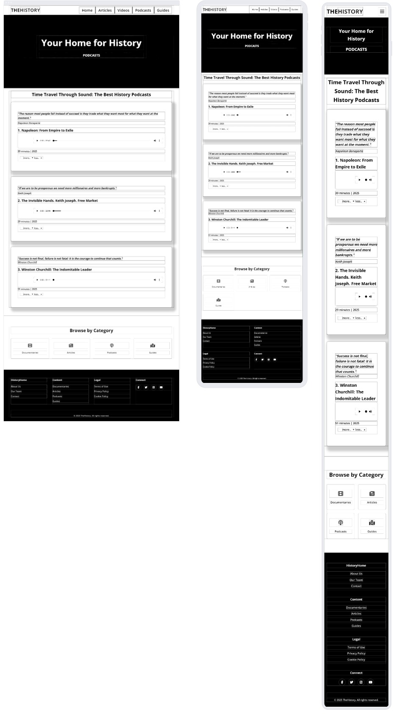
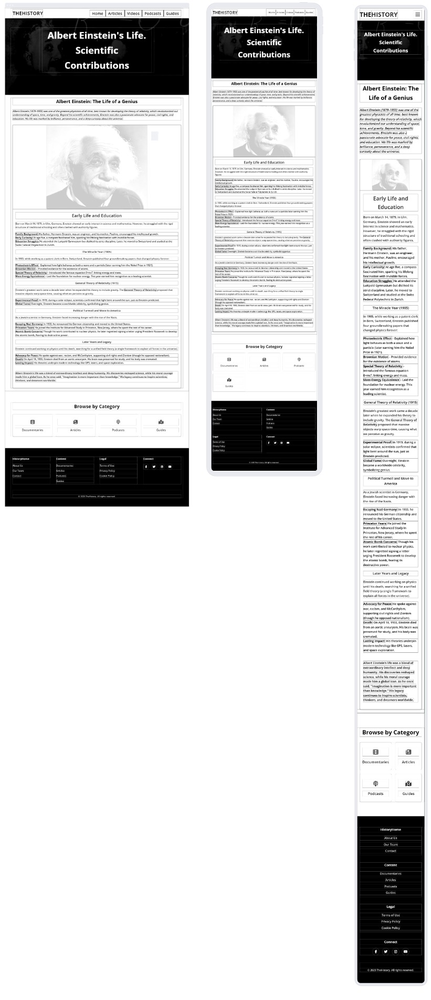

# Bodelschwinger Hof
(Developer: Ana Runje)

[Live webpage](https://natallllyyy333.github.io/rehearsal_pp1_hh/)

## Table of Content

1. [Project Goals](#project-goals)
    1. [User Goals](#user-goals)
    2. [Site Owner Goals](#site-owner-goals)
2. [User Experience](#user-experience)
    1. [Target Audience](#target-audience)
    2. [User Requrements and Expectations](#user-requrements-and-expectations)
    3. [User Stories](#user-stories)
3. [Design](#design)
    1. [Design Choices](#design-choices)
    2. [Colour](#colours)
    3. [Fonts](#fonts)
    4. [Structure](#structure)
    5. [Wireframes](#wireframes)
4. [Technologies Used](#technologies-used)
    1. [Languages](#languages)
    2. [Frameworks & Tools](#frameworks-&-tools)

## Project Goals 

### User Goals
- Finding a reliable platform for planning history-themed events or learning more about world history.  
- Accessing clear, organized information on the most important historical events, periods, and the most significant figures in history;  
- Reading articles on the most fascinating historical topics.
- Watching documentaries about the history of individual states and their role in the overall historical process.
- Listening to podcasts about the lives of the most important historical figures. - Exploring guides to key historical sites.
- Easily navigating the site to find specific resources or sections.  
- Contacting the site owner or community for support or collaboration.

### Site Owner Goals
- Showcase educational content on the World History.  
- Attract and engage a target audience interested in History.  
- Provide an intuitive way for users to interact (social links).  
- Deliver essential information in an accessible, visually appealing format.  

## User Experience

### Target Audience
- Students seeking learning resources.  
- Professionals looking for templates/tools.  
- Collaborators interested in joint projects.  

### User Requrements and Expectations

- A simple and intuitive navigation system.
- Fast access to core content. 
- Links and functions that work as expected.
- Good presentation and a visually appealing design regardless of screen size.
- An easy way to contact the website administration.
- Simple content that the user can skim read.
- Accessibility (contrast, keyboard navigation).  
- Clear calls-to-action ("Download," "Contact").  

### User Stories

#### First-time User 
1. As a first-time visitor, I want to understand the site’s purpose immediately.  
2. As a first-time visitor, I want to explore key sections without confusion.  
3. As a first-time visitor, I want to find contact or support options. 

#### Returning User
4. As a returning visitor, I want to check for updates/new content.  
5. As a returning visitor, I want to share feedback or suggestions.  
6. As a returning visitor, I want to bookmark useful resources. 

#### Site Owner 
7. As the owner, I want users to engage with new content: articles, documentaries, podcasts, guides.  
8. As the owner, I want to highlight most significant historical topics.  

## Design

### Design Choices
The site embraces a vibrant aesthetic to reflect the history theme. Key elements include:  
- consistent card layouts for content blocks.  
- custom icons for visual guidance.

### Colour
Cool blues and grays for a calm, professional feel.
Reds and Blacks for highlight and contrast.  
- Tested for accessibility using [WebAIM].  
- Primary Color: #1a1a1a (Dark gray, used for headings and key text)

- Secondary Color: #4a4a4a (Medium gray, used for secondary text/borders)

- Accent Color: #f5f5f5 (Light gray/white, used for backgrounds)
 

Color Contrast (WCAG Compliance)
Tested with WebAIM Contrast Checker:

- Element	Foreground	Background	Ratio	WCAG Rating
- Main text (#1a1a1a)	#1a1a1a	#ffffff	15.9:1	AAA
- Secondary text (#4a4a4a)	#4a4a4a	#ffffff	7.3:1	AAA
- Button text (#ffffff)	#ffffff	#1a1a1a	15.9:1	AAA
- All text passes AA/AAA standards.

### Fonts
- Primary Font: Montserrat - Used for body text, chosen for its clean lines and excellent legibility across devices
- Heading Font: Roboto - Applied to all headings (H1-H6), providing strong visual hierarchy
- Special Elements: Pinyon Script with cursive fallback - Reserved for decorative elements to add elegant flourishes
 Both Montserrat and Roboto are recognized as dyslexia-friendly typefaces, ensuring accessibility for all users.

### Structure
The website is structured in a well known, recognizable, user friendly, and easy to learn way. Upon arriving to the website the user sees a familiar type of navigation bar with the website logo on the left side and the navigation links to the right. A 'Browse by Category' section below the main section of a page and a footer with links to pages: About Us, Our Team, Contact, Documentaries, Articles, Podcasts, Guids, Terms of Use, Privacy Policy, Cokie Policy and the social links.
The website consists of 17 separate pages: 
1. A homepage with a main navigation manu, a section with Featured content cards with short description, themed imagies and links to the according content on Articles page, Documentaries page and Podcasts page.
2. An Articles page with a section with cards with short description, themed imagies and links to an according article page.
3. Separate article pages include: Ada Lovelace article page, Albert Enstein article page, First Train  article page, 11 main Events article page, 17 most singnificant historical figures article page, Roman Empire article page.
4. Documentaries page include varousel sections with videos on History of Egupt, Europe and World.
5. Podcasts page include podcasts on Life and Echievements of historical figures with their pictures and short description.
6. About Us page includes our Mission, our Offers, Our Vision sections.
7. Our Team page includes Our Story, and a schort selfpresentation of the team.
8. Contact page include the contats of the website owner and administration.
9. Terms of Use provide Use of Content, User Responsibilities, Disclamer and Change of Termination sections.
10. Privacy Policy page explains how the website administration handle the user's information when they visit the site.
11. Cookie Policy page provide the policy of the use of cookies on the website.

### Wireframes

Index

Articles

Documentaries

Podcasts

Guides

About Us

Guides

## Technologies Used

### Languages
- HTML
- CSS

### Frameworks & Tools
- Bootstrap v5.0
- Git
- GitHub
- Gitpod
- Tinypng
- Paint.NET
- Balsamiq
- Google Fonts
- Adobe Color
- Font Awsome
- Favicon.io

