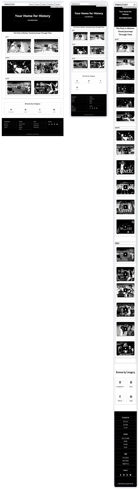
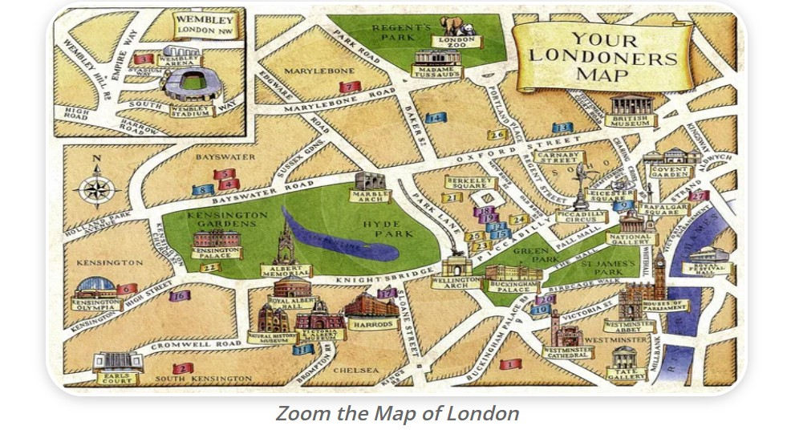
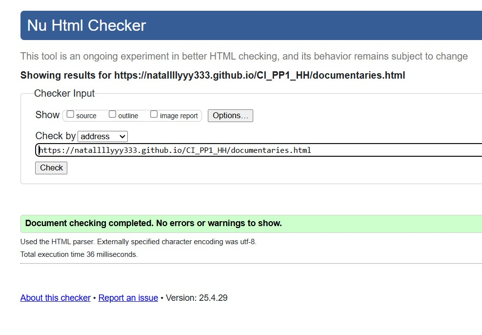
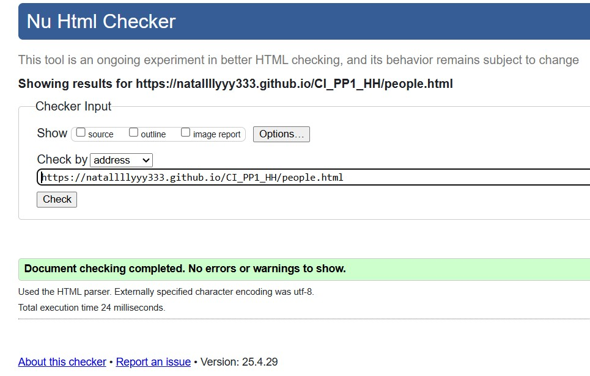
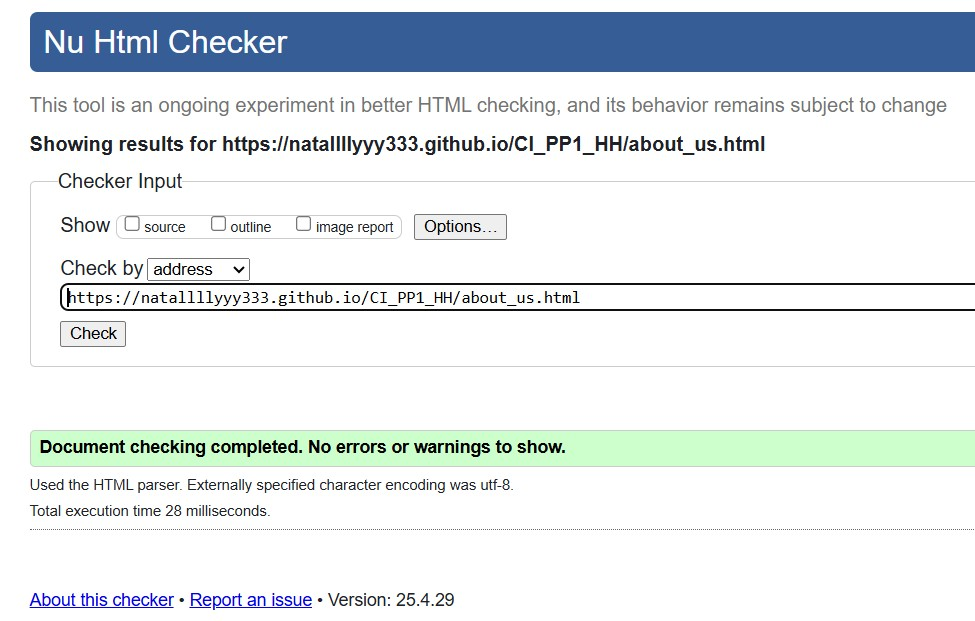
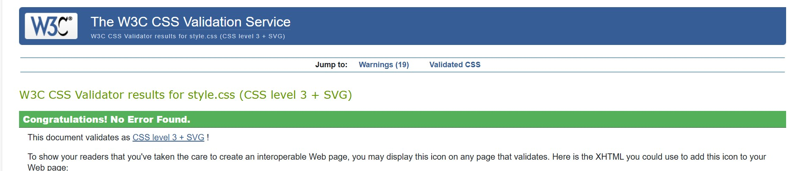
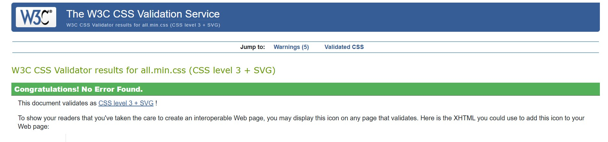
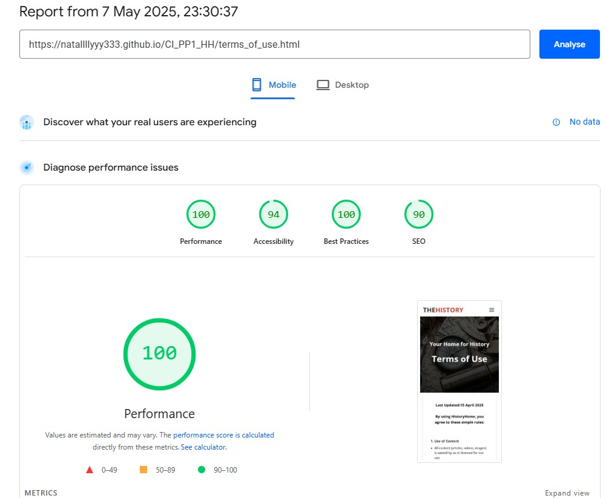

# Bodelschwinger Hof
(Developer: Ana Runje)

[Live webpage](https://natallllyyy333.github.io/rehearsal_pp1_hh/)

## Table of Content

1. [Project Goals](#project-goals)
    1. [User Goals](#user-goals)
    2. [Site Owner Goals](#site-owner-goals)
2. [User Experience](#user-experience)
    1. [Target Audience](#target-audience)
    2. [User Requrements and Expectations](#user-requrements-and-expectations)
    3. [User Stories](#user-stories)
3. [Design](#design)
    1. [Design Choices](#design-choices)
    2. [Colour](#colours)
    3. [Fonts](#fonts)
    4. [Structure](#structure)
    5. [Wireframes](#wireframes)
4. [Technologies Used](#technologies-used)
    1. [Languages](#languages)
    2. [Frameworks & Tools](#frameworks-&-tools)

## Project Goals 

### User Goals
- Finding a reliable platform for planning history-themed events or learning more about world history.  
- Accessing clear, organized information on the most important historical events, periods, and the most significant figures in history;  
- Reading articles on the most fascinating historical topics.
- Watching documentaries about the history of individual states and their role in the overall historical process.
- Listening to podcasts about the lives of the most important historical figures. - Exploring guides to key historical sites.
- Easily navigating the site to find specific resources or sections.  
- Contacting the site owner or community for support or collaboration.

### Site Owner Goals
- Showcase educational content on the World History.  
- Attract and engage a target audience interested in History.  
- Provide an intuitive way for users to interact (social links).  
- Deliver essential information in an accessible, visually appealing format.  

## User Experience

### Target Audience
- Students seeking learning resources.  
- Professionals looking for templates/tools.  
- Collaborators interested in joint projects.  

### User Requrements and Expectations

- A simple and intuitive navigation system.
- Fast access to core content. 
- Links and functions that work as expected.
- Good presentation and a visually appealing design regardless of screen size.
- An easy way to contact the website administration.
- Simple content that the user can skim read.
- Accessibility (contrast, keyboard navigation).  
- Clear calls-to-action ("Download," "Contact").  

### User Stories

#### First-time User 
1. As a first-time visitor, I want to understand the site’s purpose immediately.  
2. As a first-time visitor, I want to explore key sections without confusion.  
3. As a first-time visitor, I want to find contact or support options. 

#### Returning User
4. As a returning visitor, I want to check for updates/new content.  
5. As a returning visitor, I want to share feedback or suggestions.  
6. As a returning visitor, I want to bookmark useful resources. 

#### Site Owner 
7. As the owner, I want users to engage with new content: articles, documentaries, podcasts, guides.  
8. As the owner, I want to highlight most significant historical topics.  

## Design

### Design Choices
The site embraces a vibrant aesthetic to reflect the history theme. Key elements include:  
- consistent card layouts for content blocks.  
- custom icons for visual guidance.

### Colour
Cool blues and grays for a calm, professional feel.
Reds and Blacks for highlight and contrast.  
- Tested for accessibility using [WebAIM].  
- Primary Color: #1a1a1a (Dark gray, used for headings and key text)

- Secondary Color: #4a4a4a (Medium gray, used for secondary text/borders)

- Accent Color: #f5f5f5 (Light gray/white, used for backgrounds)
 

Color Contrast (WCAG Compliance)
Tested with WebAIM Contrast Checker:

- Element	Foreground	Background	Ratio	WCAG Rating
- Main text (#1a1a1a)	#1a1a1a	#ffffff	15.9:1	AAA
- Secondary text (#4a4a4a)	#4a4a4a	#ffffff	7.3:1	AAA
- Button text (#ffffff)	#ffffff	#1a1a1a	15.9:1	AAA
- All text passes AA/AAA standards.

### Fonts
- Primary Font: Montserrat - Used for body text, chosen for its clean lines and excellent legibility across devices
- Heading Font: Roboto - Applied to all headings (H1-H6), providing strong visual hierarchy
- Special Elements: Pinyon Script with cursive fallback - Reserved for decorative elements to add elegant flourishes
 Both Montserrat and Roboto are recognized as dyslexia-friendly typefaces, ensuring accessibility for all users.

### Structure
The website is structured in a well known, recognizable, user friendly, and easy to learn way. Upon arriving to the website the user sees a familiar type of navigation bar with the website logo on the left side and the navigation links to the right. A 'Browse by Category' section below the main section of a page and a footer with links to pages: About Us, Our Team, Contact, Documentaries, Articles, Podcasts, Guids, Terms of Use, Privacy Policy, Cokie Policy and the social links.
The website consists of 17 separate pages: 
1. A homepage with a main navigation manu, a section with Featured content cards with short description, themed imagies and links to the according content on Articles page, Documentaries page and Podcasts page.
2. An Articles page with a section with cards with short description, themed imagies and links to an according article page.
3. Separate article pages include: Ada Lovelace article page, Albert Enstein article page, First Train  article page, 11 main Events article page, 17 most singnificant historical figures article page, Roman Empire article page.
4. Documentaries page include varousel sections with videos on History of Egupt, Europe and World.
5. Podcasts page include podcasts on Life and Echievements of historical figures with their pictures and short description.
6. About Us page includes our Mission, our Offers, Our Vision sections.
7. Our Team page includes Our Story, and a schort selfpresentation of the team.
8. Contact page include the contats of the website owner and administration.
9. Terms of Use provide Use of Content, User Responsibilities, Disclamer and Change of Termination sections.
10. Privacy Policy page explains how the website administration handle the user's information when they visit the site.
11. Cookie Policy page provide the policy of the use of cookies on the website.

### Wireframes

Index

Articles

Documentaries

Podcasts

Guides

About Us

Guides

## Technologies Used

### Languages
- HTML
- CSS

### Frameworks & Tools
- Bootstrap v5.0
- Git
- GitHub
- Gitpod
- Tinypng
- Paint.NET
- Balsamiq
- Google Fonts
- Adobe Color
- Font Awsome
- Favicon.io

## Features
The page consists of seventeen pages and fourteen features

### Logo and Navigation Bar
- Featured on all seventeen pages
- The navbar is fully responsive and changes to a toggler (hamburger menu) on smaller screens and includes
links to the Homepage, Articles page, Documentaries page, Podcasts page, Guides page, Roman Empire Article page, Ada Lovelace Article page, First Train Article page, Einstein Article page, Historical Events Article page, Historical Figures Article page, About Us page, Our Team page, Contact us page, Privacy Policy page, Cookie Police page, Terms of Use page.
- It allows users to easily navigate the page
- The link for the page the user is currently on is highlighted 

### Hero Section
- Introduces the user to the website with a themed banner
- Eye-Catching Imagery – High-quality visuals to grab attention.
- Headline & Subheadline – Title of the page, motto and content overview
 

### Content Showcase Module
- Allowes the user to see diverse content formats in a scannable way
- Allowes the user to see duration, media type and topics.
- User stories covered: 13

### Feature Browse by Category Module
- Consists of four streamlined categories: Documentaries, Articles, Podcasts, Guides — allowing users to quickly filter content by their preferred format
- Clean, minimal design: Bold heading (# Browse by Category) with direct text links for effortless navigation
- Simplifies content discovery
- Reduces user effort by eliminating nested menus
- Encourages exploration of diverse media types
- User stories covered: 13

### Footer
- Featured on all seventeen pages
- Consists of five distinct sections: Brand identity, quick navigation links, legal policies, and copyright notice
- Organized into columns for clear visual hierarchy and easy user access
- Includes essential elements:
1. About Us: Direct links to About Us, Our Team and Contact pages.
2. Content Hub: Quick access to Documentaries, Articles, Podcasts, and Guides
3. Legal Compliance: Links to Terms of Use, Privacy Policy, and Cookie Policy
4. Social Media Links: Encourages cross-platform interaction
5. Copyright & Branding: Displays "© 2025 HistoryHome. All rights reserved." for legal protection and brand consistency
- User stories covered: 1, 6, 7, 10, 15

### Article Cards Feature
- Displays engaging article previews in a clean, card-based layout, allowing users to quickly scan and select content of interest
- Each card includes:
1. Title: Bold, descriptive headings (e.g., "The Rise and Fall of the Roman Empire").
2. Read Time: Clear duration indicator (e.g., 15 min read) for user convenience.
3. Teaser Text: A concise, compelling summary of the article’s focus.
4. Visual Separators: Clean dividers (---) between cards for improved readability
- Encourages content exploration with scannable, digestible previews.
- Helps users prioritize reading based on interest and time availability.
- Maintains a consistent and organized layout for all article listings.
- User stories covered: 1, 6, 7, 10, 15

### Video Section Navigation Bar Feature
- Provides intuitive category filtering with clear, concise tabs: EGYPT, EUROPE, WORLD.
- Minimalist design: Bold, all-caps text labels for quick scanning and seamless navigation.
- Enables users to instantly switch between regional/thematic video collections.
- Optimizes content discoverability without overwhelming UI.
- Maintains consistency with the site's clean aesthetic.
- User stories covered: 1, 6, 7, 10, 15

### Video Cards Carousel Feature
- Displays a scrollable carousel of 6 video cards, allowing users to browse and select content effortlessly.
- Each video card includes:
1. Category Label (e.g., EGYPT) for quick topic identification
2. Title (e.g., "The Egyptian and Hittite Peace Treaty") with engaging formatting.
3. Duration (e.g., *2:48*) to help users manage their time.
4. Horizontal scrolling for intuitive navigation on screens of above 768px width, vertical on up to 767px width.
5. Enhances content discoverability with a compact, interactive layout.
6. Encourages binge-watching behavior by surfacing related videos.
7. Optimizes space while maintaining readability and visual appeal.
- User stories covered: 1, 6, 7, 10, 15

### Podcasts Feature
- Showcases curated history podcasts with immersive preview cards that blend content, context, and inspiration.
- Each podcast card includes:
1. Engaging title (e.g., "Napoleon: From Empire to Exile")
2. Notable quote from the episode or subject (e.g., Churchill’s "Success is not final...")
3. Host/creator (e.g., SAN FRED)
4. Duration & release year (e.g., *51 minutes | 2025*)
5. Interactive buttons for user actions (play, pause, volume control, playback speed).
- User stories covered: 1, 6, 7, 10, 15

### Podcast Accordion Feature
- Interactive expandable/collapsible section that reveals in-depth podcast content, including transcripts, historical context, and key quotes.
- Structured layout with:
1. Hero quote (e.g., "Success is not final, failure is not fatal...") to set the tone.
2. Podcast metadata (title, duration, release year).
3. Audio progress bar (*0:00 / 51:11*) for real-time tracking.
4. Toggle button (more... ▼ / less... ▲) to expand/collapse full content.
5. Rich transcript with historical insights, timestamps, and supplemental quotes (e.g., Churchill’s 1941 speech).
- Deepens engagement by offering both audio and text-based consumption.
- Enhances accessibility for users who prefer reading or need transcripts.
- Provides educational value through curated historical context.
- User stories covered: 1, 6, 7, 10, 15

### History Timeline Feature
- Presents key historical events in a visually engaging chronological timeline, allowing users to journey through significant moments in London’s history.
- Each timeline entry includes:
1. Event title (e.g., Roman Londinium, The Blitz) with clear heading hierarchy
2. Concise historical summary (2-3 sentences) highlighting the event’s significance.
3. Key dates (e.g., *43 AD, 1066, 1666*) for quick reference.
- Allows user to break down complex history into digestible, scannable segments.
- Provides visual chronology: Helps users grasp the sequence and impact of events.
- Encourages user's exploration with a mix of political, cultural, and catastrophic milestones.
- User stories covered: 1, 6, 7, 10, 15

### Video Guide Feature
- Displays a prominent 45-minute video guide (e.g., "Explore London") as an immersive visual introduction to the location.
- Minimalist, high-impact design with:
1. Duration label (*45:00*) to set expectations.
2. Clear call-to-action title (Explore London) in bold typography.
3. Thumbnail image/play button overlay.
- Virtual tourism: Offers users a cinematic overview of key landmarks/history.
- Time transparency: Duration label helps users commit to viewing.
- Gateway feature: Encourages further exploration of related content (articles, maps).
- User stories covered: 1, 6, 7, 10, 15

### Interactive Zoomable London Map Guide
- Interactive, zoomable map of London with labeled districts (e.g., Wembley, Kensington, Chelsea) for intuitive navigation.
- Clean, minimalist design with:
1. District names displayed in a clear, bold typography.
2. Call-to-action prompt ("Zoom the Map of London") encouraging user interaction.
- Dynamic functionality:
1. Smooth zoom/pan controls (touch or mouse).
2. Responsive to all device screens.
- Helps users visualize London’s layout and key areas.
- Interactive elements invite users's exploration.
- Acts as a visual guide for tourists, historians, or locals.
- User stories covered: 1, 6, 7, 10, 15

### Downloadable City Guide Feature
- Prominently displayed call-to-action for users to download a comprehensive PDF city guide (e.g., "The Complete City Guide").
- Clear, user-friendly design with:
1. Title & description ("Download a detailed PDF guide with routes and attractions") explaining the guide’s value.
2. Download button with file size transparency ("Download PDF (14.3 MB)").
- Offline accessibility: Lets users explore without internet.
- Trust-building: File size disclosure manages user expectations.
- User stories covered: 1, 6, 7, 10, 15

### Article Feature
- Presents in-depth, engaging long-form articles with structured sections, designed to inform and captivate readers.
- Key elements include:
1. Strong headline ("5 Fascinating Facts About Ada Lovelace...") to immediately hook interest.
2. Subheadings (e.g., "Daughter of a Famous Poet") for easy scanning.
3. Pull quotes ("Poetical science") to highlight key insights.
4. Visual dividers (---) for clean section breaks.
5. Concise, lively prose blending history, anecdotes, and analysis.
- Education: Delivers authoritative yet accessible historical/scientific narratives.
- Engagement: Uses storytelling techniques (e.g., humor, tragedy) to humanize subjects.
- Shareability: Optimized for social sharing with standout quotes/facts.
- User stories covered: 1, 6, 7, 10, 15

### About Us
- Introduces the brand’s mission, offerings, and values in a structured, engaging format designed to connect with audiences.
- Key sections include:
1. Mission Statement – A compelling overview of the brand’s purpose ("The past is not just a series of dates and events...").
2. What We Offer – Detailed breakdown of content formats (documentaries, podcasts, articles, travel guides) with persuasive descriptions.
3. Why Choose Us – Bullet-pointed USPs (e.g., "Trusted Experts," "Cinematic Quality") with visual checkmarks for emphasis.
4. Vision Statement – Forward-looking narrative about redefining history education.
- Brand Identity: Communicates ethos, quality standards, and uniqueness.
- User Conversion: Encourages exploration of content by highlighting variety and expertise.
- Trust-Building: Showcases authority (historians, filmmakers) and global perspective.
- User stories covered: 3, 14

### Our Team Feature
- Showcases the people and passion behind the brand, blending origin stories, team roles, and mission-driven philosophy.
- Structured into clear sections:
1. Origin Story – Founder-led narrative ("Founded in 2025 by Nataliia Illiashenko...") with growth milestones.
2. Team Breakdown – Role-based highlights (Researchers, Storytellers, Innovators) emphasizing expertise and collaboration.
3. Mission Statement – Conviction-driven call-to-action ("We believe history shouldn’t be confined...") with relatable examples (myth-busting, travel guides).
4. Inspirational Quote – Closing literary flourish ("The past is never dead...") to reinforce purpose. 
- Humanizes the brand: Puts faces and stories behind the content.
- Builds credibility: Highlights awards, qualifications, and niche roles (e.g., Emmy-nominated filmmakers).
- Engages talent/partners: Signals professionalism and creative ambition.
- User stories covered: 3, 14

### Contact Us Feature
- Invites user engagement through multiple structured contact points, emphasizing approachability and collaboration.
- Organized into clear sections:
1. Intro Statement – Brand philosophy ("history is a conversation—not a monologue") to set a welcoming tone.
2. Purpose-Specific Email Links – Categorized inquiries (General, Podcasts, Partnerships, Submissions) with expected response times.
- Physical Address – For formal visits (with remote-work disclaimer).
- Encourages interaction: Makes reaching out easy for users, experts, and partners.
- Streamlines communication: Directs queries to the right team (e.g., podcasts@historyhome.com for show ideas).
- Professional transparency: Discloses response times and remote-work policy.
- User stories covered: 3, 14

### Terms of Use Feature
- Outlines clear, digestible rules for using the TheHistory platform, balancing legal precision with user-friendly language.
- Structured into key sections:
1. Content Usage – Defines permissions/restrictions (personal use only, no unauthorized redistribution).
2. User Obligations – Age requirement (13+), prohibition of harmful activities (hacking, spamming).
3. Disclaimer – Transparency about content accuracy and third-party links.
4. Policy Flexibility – Notes on updates/termination rights.
- Legal Compliance: Meets GDPR, COPPA, and copyright requirements.
- Risk Mitigation: Protects intellectual property and deters misuse.
- User Clarity: Avoids legalese with bullet points and plain English.
- User stories covered: 3, 14

### Privacy Policy Feature
- Transparently outlines data practices in clear, jargon-free language to comply with GDPR, CCPA, and other privacy regulations.
- Structured into digestible sections:
1. Data Collection – Specifies types (anonymized usage data, voluntary contact info) and methods (cookies).
2. Usage Purpose – Improvement of services and user communication.
3. Cookie Disclosure – Explains minimal tracking and opt-out instructions.
4. Third-Party Sharing – Strictly limited to essential providers/legal requirements.
5. User Rights – Deletion requests and cookie controls.
- Regulatory Compliance: Meets legal standards while avoiding intimidating legalese.
- Trust Building: Explicit "no data selling" pledge reassures users.
- User Empowerment: Clear opt-out/correction steps put visitors in control.
- User stories covered: 3, 14

### Cookie Policy Feature
- Clearly explains cookie usage in plain language to comply with GDPR/ePrivacy requirements.
- Structured for transparency:
1. Cookie Definition – Simple explanation of what cookies are.
2. Classification – Essential (required) vs. Optional (analytics).
3. User Controls – Browser settings and opt-out tools.
4. No-Tracking Pledge – Explicit "no ads/no personal data" assurance.
- Legal Compliance: Meets EU/US transparency mandates.
- User Trust: Discloses minimal, non-invasive tracking.
- Empowerment: Provides clear opt-out instructions.
- User stories covered: 3, 14

## Validation

### HTML Validation
The W3C Markup Validation Service was used to validate the HTML of the website. All pages pass with no errors no warnings to show.

Home

Articles

Documentaries

Podcasts

Guides

Roman Empire Article

Ada Lovelace Article

First Train Article

Einstein Article

Events Article

People Page

About Us

Our Team

Contact Us

Terms of Use

Privacy Policy

Cookie Policy

### CSS Validation
The W3C Jigsaw CSS Validation Service was used to validate the CSS of the website.
Passes with no errors.
Some warnings related to:
- Vendor-specific prefixes (e.g., -webkit-image-set)
- Deprecated properties (e.g., clip)
- Non-standard pseudo-elements (e.g., ::-webkit-media-controls-panel)

style.css

all.min.css

### Accessibility
The WAVE WebAIM web accessibility evaluation tool was used to ensure the website met high accessibility standards. All pages pass with 0 errors.

Home

Articles

Documentaries

Podcasts

Guides

Roman Empire Article

Ada Lovelace Article

First Train Article

Einstein Article

Events Article

People Page

About Us

Our Team

Contact Us

Terms of Use

Privacy Policy

Cookie Policy

### Performance 
Google Lighthouse in Google Chrome Developer Tools was used to test the performance of the website. 

Home

Articles

Documentaries

Podcasts

Guides

Roman Empire Article

Ada Lovelace Article

First Train Article

Einstein Article

Events Article

People Page

About Us

Our Team

Contact Us

Terms of Use

Privacy Policy

Cookie Policy

### Performing tests on various devices 
The website was tested on the following devices:
- Lenovo Yoga 2 Pro (both in pc and tablet mode)
- Honor 20 pro
- Xiaomi Redmi Note 7

In addition, the website was tested using Google Chrome Developer Tools Device Toggeling option for all available device options.

### Browser compatability
The website was tested on the following browsers:
- Google Chrome
- Mozilla Firefox
- Microsoft Egde

### Testing user stories
1. As a first time user, I want to know content formats, duration, media type, topics presented on the website

| **Feature** | **Action** | **Expected Result** | **Actual Result** |
|-------------|------------|---------------------|-------------------|
| feature-main | Navigate to the Content Showcase Module of Home page  | Scan the diverse content formats presented, explore duration, media type and topics | Works as expected |

Screenshots

2. As a first time user, I want to know the price range

| **Feature** | **Action** | **Expected Result** | **Actual Result** |
|-------------|------------|---------------------|-------------------|
| Menu | Navigate to the Menu page | See prices on menu page | Works as expected |

Screenshots

3. As a first time user, I want to know more about the restaurant

| **Feature** | **Action** | **Expected Result** | **Actual Result** |
|-------------|------------|---------------------|-------------------|
| About Us | Navigate to the About page and locate the About Us section | Find description of the restaurant | Works as expected |
| Customer reviews | Navigate to the About page, scroll down to What our guests say section | Read customer reviews | Works as expected | 

Screenshots

4. As a first time user, I want to get a feel of what to expect at the restaurant

| **Feature** | **Action** | **Expected Result** | **Actual Result** |
|-------------|------------|---------------------|-------------------|
| Gallery | Navigate to the Gallery page | Find pictures of the restaurant and food served there | Works as expected |
| Promo video | Navigate to the GAlelry page and scroll to the promo video | Watch promo video | Works as expected |

Screenshots

5. As a returning user, I want to see the Sunday meal offer

| **Feature** | **Action** | **Expected Result** | **Actual Result** |
|-------------|------------|---------------------|-------------------|
| Meal-deal | On home page scroll down to the Sunday meal deal section | Find the meal-deal for the upcomming Sunday | Works as expected |

Screenshots

6. As a returnign user, I want to know the opening times

| **Feature** | **Action** | **Expected Result** | **Actual Result** |
|-------------|------------|---------------------|-------------------|
| Footer - opening times section | On any page scroll to the footer | See opening times | Works as expected |

Screenshots

7. As a returning user, I want to find a phone number to call for reservation

| **Feature** | **Action** | **Expected Result** | **Actual Result** |
|-------------|------------|---------------------|-------------------|
| Footer - contact information section | On any page scroll to the footer | See phone number | Works as expected |
| Info Box | Navigate to Contact Us page and locate the How to find us section | See phone number | Works as expected |

Screenshots

8. As a returning user, I want to see the menu

| **Feature** | **Action** | **Expected Result** | **Actual Result** |
|-------------|------------|---------------------|-------------------|
| Menu | Navigate to the menu page | Read the menu | Works as expected |

Screenshots

9. As a returning user, I want to leave some comment, suggestion or message to the staff

| **Feature** | **Action** | **Expected Result** | **Actual Result** |
|-------------|------------|---------------------|-------------------|
| Contact Form | Navigate to the Contact Us Page and locate the contact form, fill out and submit contact form | Data submited via contact form | Works as expectd |

Screenshots

10. As a returning user, I want to find the restaurant on social media

| **Feature** | **Action** | **Expected Result** | **Actual Result** |
|-------------|------------|---------------------|-------------------|
| Footer - social media section | On any page scroll to the bottom | Click on social media links | Works as expected | 

Screenshots

11. As a returning user, I want to know who is preparing the food

| **Feature** | **Action** | **Expected Result** | **Actual Result** |
|-------------|------------|---------------------|-------------------|
| Meet the Chef | Navigate to the About page and scroll down to Meet the Chef section | Find brief bio of the Chef | Works as expected |

Screenshots

12. As a returning user, I want to get directions to the restaurant

| **Feature** | **Action** | **Expected Result** | **Actual Result** |
|-------------|------------|---------------------|-------------------|
| Map | Navigate to the Contact Us page, locate the map and click on directions link | See directions to the restaurant on Goole Maps | Works as expected |

Screenshots

13. As the site owner, I want users to find news about upcoming events or changes in opening times

| **Feature** | **Action** | **Expected Result** | **Actual Result** |
|-------------|------------|---------------------|-------------------|
| News | Scroll down on home page and locate news section | Find latest news | Works as expected |

Screenshots

14. As the site owner, I want users to get to know the restaurant 

| **Feature** | **Action** | **Expected Result** | **Actual Result** |
|-------------|------------|---------------------|-------------------|
| About Us | Navigate to About page and locate About Us section | See relevant information about the restaurant | Works as expected |

Screenshots

15. As the site owner, I want the users to be able to contact us

| **Feature** | **Action** | **Expected Result** | **Actual Result** |
|-------------|------------|---------------------|-------------------|
| Contact Form | Navigate to the Contact Us Page and locate the contact form, fill out and submit contact form | Data submited via contact form | Works as expectd |
| Info Box | Navigate to Contact Us page and locate the How to find us section | Find the phone number | Works as expected |
| Footer - contact information section | On any page scroll down to the footer | Find the phone number | Works as expected |

Screenshots

## Bugs

